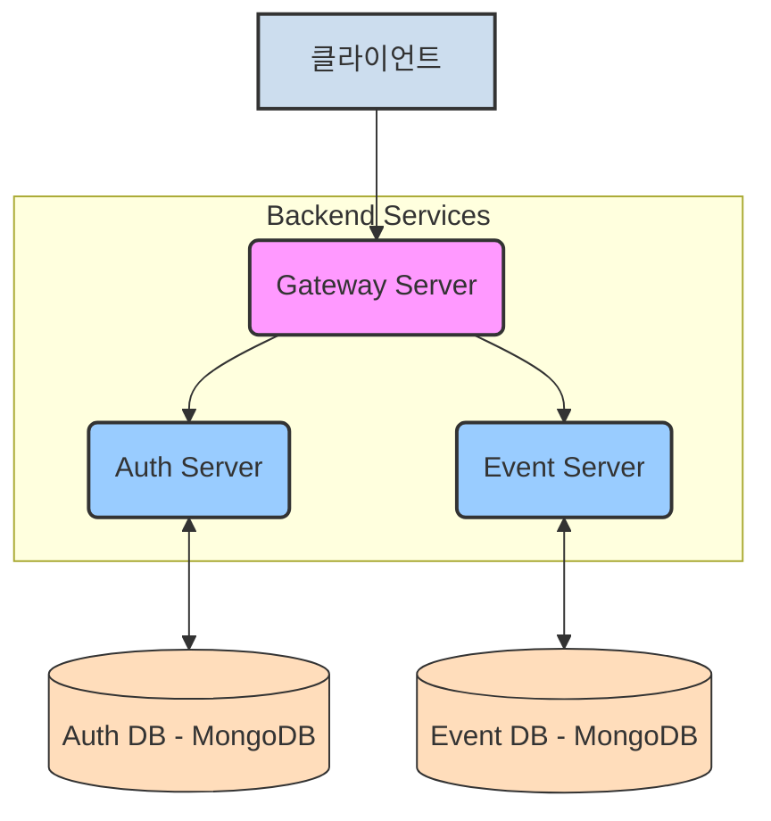
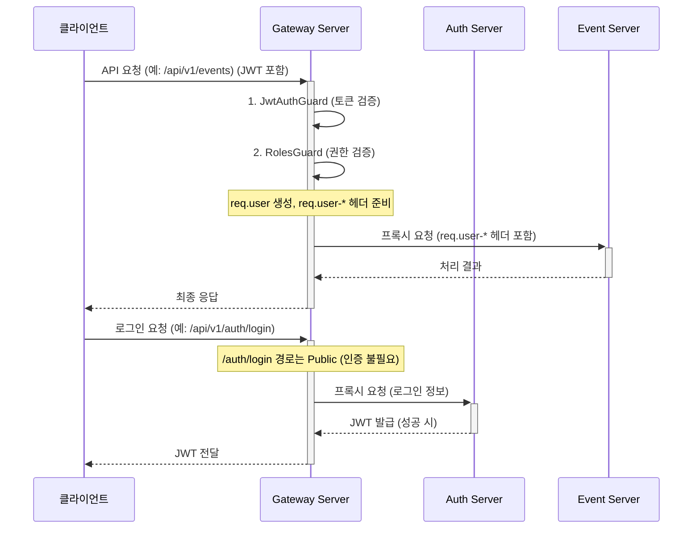
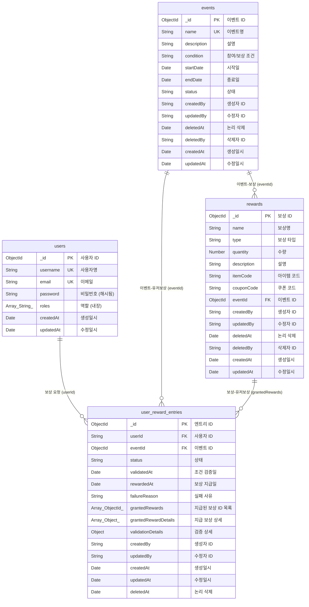

\

# 이벤트 보상 플랫폼 백엔드 시스템

본 프로젝트는 NestJS, TypeScript, MongoDB를 기반으로 구축된 마이크로서비스 아키텍처(MSA) 기반 이벤트 보상 플랫폼 백엔드 시스템입니다.

## 0. 서버 별 정리된 내용들

`apps/auth-server` `apps/gateway-server` `apps/event-server` 폴더 내 `ReadMe`를 통해 확인하실 수 있습니다.

## 1. 실행 방법

```bash
yarn docker:build
```

```bash
yarn docker:up
```

각 서버를 실행하려면 해당 서버 디렉토리로 이동하여 다음 명령어를 실행합니다. (환경 변수 설정 필요 - 각 서버의 `.env.example` 참조)

**환경 변수 설정:**

도커를 활용해 서버를 운영하는 경우 `.env.docker`를 사용하면 됩니다.

**주요 환경 변수:**

* `PORT`: 각 서버가 실행될 포트 번호
* `MONGODB_URI`: MongoDB 접속 주소
* `MONGODB_DB_NAME`: 사용할 데이터베이스 이름
* `JWT_SECRET`: JWT 서명 및 검증에 사용될 비밀 키 (모든 서버가 동일한 값을 사용해야 함)
* `JWT_EXPIRES_IN`: JWT 유효 기간 (예: `60m`, `1d`)
* `AUTH_SERVER_URL` (Gateway Server용): Auth Server의 주소
* `EVENT_SERVER_URL` (Gateway Server용): Event Server의 주소

## 2. 프로젝트 목표 및 요구사항

* 게임 내 다양한 이벤트 생성 및 보상 정의 기능
* 사용자의 이벤트 참여 및 조건 달성 시 보상 요청 기능
* 관리자/운영자의 이벤트 및 보상 관리 기능
* 감사 담당자의 보상 지급 내역 조회 기능
* 안정적이고 확장 가능한 백엔드 시스템 구축

## 3. 아키텍처 및 주요 흐름

### 3.1. 시스템 구성도 (Mermaid)



### 3.2. 서버 역할

* **Gateway Server**:
  * API 진입점 (API Gateway) 역할. 모든 외부 요청은 Gateway를 통해 내부 서비스로 라우팅됩니다.
  * **인증 및 권한 검사**: JWT 기반 토큰 검증 및 역할(Role) 기반 접근 제어(RBAC)를 수행합니다.
  * 요청 라우팅: `/api/v1/auth/**` 요청은 `Auth Server`로, `/api/v1/events/**` 요청은 `Event Server`로 전달합니다.
  * 공통 기능 처리: 로깅, 요청/응답 변환 등의 공통 관심사를 처리할 수 있습니다. (현재는 기본 프록시 기능 위주)
* **Auth Server**:
  * 사용자 정보 관리 (계정, 프로필 등)
  * 회원가입, 로그인 처리 및 JWT 발급/갱신
  * 사용자 역할(Role) 관리
* **Event Server**:
  * 이벤트 생성, 조회, 수정, 삭제 기능
  * 이벤트 조건 및 보상 아이템 정의
  * 사용자의 보상 요청 처리 및 지급 상태 관리 (요청 검증, 보상 지급 로직)

### 3.3. Gateway Server 주요 동작

1. **API 진입점**: 모든 외부 요청은 Gateway Server의 `/api/v1` 전역 접두사를 통해 시스템으로 진입합니다.
2. **전역 인증/인가 Guard**:
   * **`JwtAuthGuard` (전역 적용)**:
     * 요청 헤더의 `Authorization: Bearer <토큰>`에서 JWT를 추출하여 유효성을 검증합니다 (서명, 만료 시간 등 - `JWT_SECRET` 환경 변수 사용).
     * 검증 성공 시, 토큰의 페이로드(userId, username, roles)를 `req.user` 객체에 저장하여 다음 단계로 전달합니다.
     * 컨트롤러나 핸들러에 `@Public()` 데코레이터가 적용된 경우, 이 인증 과정을 건너뜁니다. (예: 로그인, 회원가입 엔드포인트)
   * **`RolesGuard` (전역 적용)**:
     * `JwtAuthGuard` 실행 후 동작합니다.
     * 컨트롤러나 핸들러에 `@Roles(UserRole.ADMIN, ...)` 데코레이터로 지정된 역할과 `req.user.roles`를 비교합니다.
     * 사용자가 필요한 역할을 가지고 있지 않으면 `ForbiddenException` (403 에러)을 발생시켜 접근을 차단합니다.
     * `@Roles()` 데코레이터가 없는 경로는 역할 검사를 수행하지 않고 통과합니다 (즉, 인증만 되면 접근 가능).
3. **요청 프록시 및 사용자 정보 전달**:
   * `AppController`의 와일드카드 라우트 (`@All('*')`)가 모든 경로의 요청을 받아 `AppService`의 `proxyRequest` 메소드로 전달합니다.
   * `AppService`는 요청 URL의 접두사 (예: `/api/v1/auth/**`, `/api/v1/events/**`)를 분석하여, 환경 변수 (`AUTH_SERVER_URL`, `EVENT_SERVER_URL`)에 정의된 각 마이크로서비스(Auth Server, Event Server)로 요청을 전달(프록시)합니다.
   * 프록시 요청 시, 기존 클라이언트 헤더와 함께 Gateway에서 인증된 사용자의 정보(`userId`, `username`, `roles`)를 각각 `X-User-Id`, `X-User-Username`, `X-User-Roles`라는 커스텀 헤더에 담아 하위 마이크로서비스로 전달합니다. 이를 통해 하위 서비스는 요청자 정보를 활용할 수 있습니다.
4. **Gateway 상태 확인**:
   * Gateway의 루트 경로 (`/api/v1/`)로 GET 요청 시, "Gateway is running" 메시지를 반환하여 서비스 상태를 확인할 수 있습니다. (이 경로는 `@Public()`으로 처리하는 것이 좋습니다.)

### 3.4. 주요 요청 흐름 예시 (Mermaid)



## 4. 설계 결정 사항 및 고려 사항

### 4.1. ODM (Object Data Mapper) 선택: Mongoose

본 프로젝트에서는 NestJS와 MongoDB를 연동하기 위한 ODM으로 **Mongoose**를 선택했습니다. 주요 이유는 다음과 같습니다.

* **NestJS와의 뛰어난 통합성:** `@nestjs/mongoose` 패키지를 통해 NestJS 애플리케이션에 Mongoose를 매우 쉽고 효율적으로 통합할 수 있습니다. 모듈, 서비스, 프로바이더 등 NestJS의 핵심 개념들과 자연스럽게 어우러집니다.
* **스키마 기반 모델링:** Mongoose는 스키마를 사용하여 데이터 모델을 정의하고, 각 필드의 타입, 기본값, 유효성 검사 규칙 등을 명시적으로 관리할 수 있게 해줍니다. 이는 TypeScript의 정적 타이핑과 잘 부합하며, 개발 초기 단계부터 데이터의 일관성과 무결성을 확보하는 데 도움을 줍니다.
* **강력한 쿼리 빌더 및 유틸리티:** 복잡한 쿼리 작성, 데이터 populate (참조된 문서 로드), 미들웨어 (pre/post hooks), 가상 필드(virtuals) 등 개발 생산성을 높여주는 다양한 기능을 제공합니다.
* **풍부한 커뮤니티와 자료:** Mongoose는 Node.js 환경에서 MongoDB를 사용하는 가장 대중적인 라이브러리 중 하나로, 방대한 커뮤니티와 수많은 레퍼런스 자료를 보유하고 있어 문제 해결 및 학습에 용이합니다.
* **유연한 스키마 설계 지원:** 이벤트 조건이나 보상 내용과 같이 변경 가능성이 높고 다양한 형태를 가질 수 있는 데이터에 대해 `Mixed` 타입이나 유연한 객체 구조를 스키마 내에 정의할 수 있어, Q&A에서 언급된 "자유로운 이벤트/보상 정의" 요구사항을 충족시키기 적합합니다.

*대안으로 MikroORM도 고려되었으나, MongoDB와의 직접적인 연동 편의성, NestJS 생태계에서의 일반적인 사용 빈도, 그리고 Mongoose가 제공하는 스키마 중심의 개발 방식이 본 프로젝트의 특성에 더 부합한다고 판단했습니다.*

### 4.2. MSA 환경에서의 데이터 일관성

본 프로젝트는 Gateway Server, Auth Server, Event Server로 구성된 마이크로서비스 아키텍처(MSA)를 따릅니다. MSA 환경에서는 각 서비스가 독립적인 데이터 저장소를 가지므로 데이터 일관성 유지가 중요한 고려 사항입니다.

* **서비스 간 데이터 소유권 명확화:**

  * `Auth Server`: 사용자 계정 정보(ID, 역할 등)에 대한 소유권을 가집니다.
  * `Event Server`: 이벤트, 보상, 사용자의 보상 요청 내역에 대한 소유권을 가집니다.
  * 각 서비스는 자신의 데이터베이스에만 직접 접근하며, 다른 서비스의 데이터는 API 호출을 통해 동기화하거나 ID를 참조하여 사용합니다.
* **일관성 수준:**

  * **최종 일관성 (Eventual Consistency):** 대부분의 경우 최종 일관성 모델을 따릅니다. 예를 들어, 사용자가 `Auth Server`에서 생성된 후, 해당 사용자 정보가 `Event Server`에서 즉시 보이지 않을 수 있지만, 결국에는 동기화되어 일관성을 유지합니다. 이벤트 목록 조회나 보상 내역 조회 등은 최종 일관성으로 충분히 처리 가능합니다.
  * **강한 일관성 (Strong Consistency) 필요 지점:**
    * **보상 지급 처리:** 사용자가 보상을 요청하고 시스템이 조건 충족 여부를 검증한 후 실제 보상을 지급(또는 지급 상태를 변경)하는 로직은 단일 `Event Server` 내에서 트랜잭션과 유사한 방식으로 처리되어야 합니다. 예를 들어, 보상 수량 차감과 사용자 요청 상태 변경은 원자적으로 이루어져야 중복 지급이나 데이터 불일치 문제를 방지할 수 있습니다. MongoDB는 단일 문서 연산에 대해서는 원자성을 보장하며, 여러 문서에 걸친 트랜잭션은 MongoDB 4.0 이상부터 지원됩니다. 상황에 따라 이를 활용하거나, 애플리케이션 레벨에서 상태 관리와 보상 로직을 신중하게 설계하여 일관성을 확보해야 합니다.
    * **중복 보상 요청 방지:** `Event Server`는 특정 사용자가 특정 이벤트에 대해 이미 보상을 요청했는지 여부를 정확히 확인하고 중복 요청을 막아야 합니다. 이는 `(userId, eventId)` 조합에 대한 고유 인덱스 설정 및 요청 처리 로직에서 강한 일관성을 필요로 합니다.
* **서비스 간 통신:** 서비스 간 데이터 동기화나 요청은 비동기 메시징 (예: Kafka, RabbitMQ - 과제 범위 초과 시 단순 API 호출) 또는 동기 API 호출을 사용할 수 있습니다. 본 과제에서는 복잡성을 고려하여 주로 동기 API 호출(Gateway를 통한) 방식을 기본으로 하되, 필요에 따라 특정 이벤트 발생 시 다른 서비스에 알리는 방식(예: 웹훅 또는 간단한 이벤트 발행)을 고려할 수 있습니다.

### 3.3. 보안 및 감사

민감한 데이터를 다루고, 사용자에게 실질적인 보상이 지급되는 시스템이므로 보안 및 감사 기능은 매우 중요합니다.

* **인증 및 권한 부여 (Gateway Server 중심):**

  * 모든 API 요청은 `Gateway Server`의 `/api/v1` 접두사를 통해 진입하며, 여기서 일차적인 인증 및 권한 부여가 처리됩니다.
  * **JWT 기반 인증**: `JwtAuthGuard`가 요청 헤더의 `Authorization: Bearer <토큰>`을 검증합니다.

    * 유효한 토큰인 경우, 페이로드(사용자 ID, 사용자명, 역할 목록)를 추출하여 `req.user` 객체에 저장합니다.
    * `@Public()` 데코레이터가 적용된 경로(예: 로그인, 회원가입)는 이 토큰 검증을 건너뜁니다.
  * **역할 기반 접근 제어 (RBAC)**: `RolesGuard`가 `JwtAuthGuard` 이후 실행됩니다.

    * `@Roles(UserRole.ADMIN, UserRole.OPERATOR, ...)` 데코레이터로 엔드포인트에 필요한 역할을 명시합니다.
    * `req.user.roles`와 필요한 역할을 비교하여, 권한이 없는 경우 `ForbiddenException` (403 에러)을 반환합니다.
    * `@Roles()` 데코레이터가 없는 엔드포인트는 인증된 모든 사용자가 접근 가능합니다.
* **데이터 보안:**

  * **민감 정보 최소화:** 사용자 비밀번호와 같은 민감 정보는 `Auth Server`에서 안전하게 해시 처리되어 저장됩니다.
  * **입력값 검증:** `class-validator`를 사용한 DTO 유효성 검사와 Mongoose 스키마 레벨 유효성 검사를 통해 악의적인 입력이나 잘못된 데이터로부터 시스템을 보호합니다. (각 서비스 레벨에서 구현)
  * **API 속도 제한 (Rate Limiting):** (선택 사항, 실제 프로덕션 고려) 과도한 요청으로 인한 서비스 장애를 방지하기 위해 `Gateway Server`에 API 속도 제한을 적용할 수 있습니다.
* **감사 추적 (Auditing):**

  * **보상 지급 내역:** "감사 담당자는 지급 내역만 조회할 수 있어야 한다"는 요구사항에 따라,
    `user-rewards` 컬렉션(이벤트 서버 소관)에 보상 요청 및 처리와 관련된 모든 중요한 정보를 기록합니다.
    * `userId` (요청한 사용자)
    * `eventId` (관련 이벤트)
    * `grantedRewards` (실제 지급된 보상 정보)
    * `requestedAt` (요청 시간)
    * `processedAt` (처리 시간)
    * `status` (요청 상태: PENDING, SUCCESS, FAILED 등)
    * `processor` (처리 주체: 'SYSTEM' 또는 운영자 ID)
    * `failureReason` (실패 사유 등)
    * 기타 감사/운영에 필요한 필드
  * **타임스탬프:** Mongoose 스키마의 `timestamps: true` 옵션을 활성화하여 모든 주요 데이터(이벤트 생성/수정, 보상 등록/수정, 요청 생성/수정 등)의 `createdAt`과 `updatedAt`을 자동으로 기록합니다. (각 서비스 레벨에서 구현)
  * **운영자 활동 로그 (선택 사항, 확장 고려):** 이벤트 생성/수정, 보상 등록/수정 등 운영자의 주요 활동에 대해서도 별도의 로그를 기록하여 시스템 변경 사항을 추적하고 문제 발생 시 원인 파악을 용이하게 할 수 있습니다. (각 서비스 레벨 또는 별도 로깅 서비스에서 구현)

> ※ 실제 컬렉션/스키마 구조 및 감사 정책, 확장성 고민 등은 `apps/event-server/README.md`에 상세히 정리되어 있습니다.

이러한 고민들은 시스템의 안정성, 확장성, 유지보수성을 높이고, "실제 프로덕션에서 이 코드를 돌려도 될까?"라는 질문에 긍정적으로 답하기 위한 노력의 일환입니다.

## 4. 데이터베이스 설계 (ERD - Mermaid)

### 4.1. 컬렉션 관계 및 주요 필드 (최신 스키마 기준)

* **`users` (Auth Server 소관)**
  * `_id`: ObjectId (PK)
  * `username`: String (고유, 인덱스, 소문자)
  * `email`: String (고유, 인덱스, 소문자)
  * `password`: String (bcrypt 해시)
  * `roles`: Array of String (Enum: USER, OPERATOR, AUDITOR, ADMIN)
  * `createdAt`, `updatedAt`: Date (Mongoose Timestamps)

* **`events` (Event Server 소관)**
  * `_id`: ObjectId (PK)
  * `name`: String (고유, 인덱스)
  * `description`: String (이벤트 설명)
  * `condition`: String (참여/보상 조건)
  * `startDate`: Date (시작일)
  * `endDate`: Date (종료일)
  * `status`: String (Enum: SCHEDULED, ACTIVE, ENDED, CANCELLED)
  * `createdBy`: String (생성자 ID)
  * `updatedBy`: String (수정자 ID)
  * `deletedAt`: Date (논리 삭제)
  * `deletedBy`: String (삭제자 ID)
  * `createdAt`, `updatedAt`: Date

* **`rewards` (Event Server 소관)**
  * `_id`: ObjectId (PK)
  * `name`: String (보상명)
  * `type`: String (Enum: POINT, ITEM, COUPON)
  * `quantity`: Number (수량)
  * `description`: String (설명)
  * `itemCode`: String (ITEM 타입일 때)
  * `couponCode`: String (COUPON 타입일 때)
  * `eventId`: ObjectId (FK to `events`)
  * `createdBy`: String (생성자 ID)
  * `updatedBy`: String (수정자 ID)
  * `deletedAt`: Date (논리 삭제)
  * `deletedBy`: String (삭제자 ID)
  * `createdAt`, `updatedAt`: Date

* **`user_reward_entries` (Event Server 소관)**
  * `_id`: ObjectId (PK)
  * `userId`: String (FK to `users`)
  * `eventId`: ObjectId (FK to `events`)
  * `status`: String (Enum: REQUESTED, PENDING_VALIDATION, VALIDATION_FAILED, PENDING_PAYOUT, REWARDED, FAILED_PAYOUT, DUPLICATE_REQUEST)
  * `validatedAt`: Date
  * `rewardedAt`: Date
  * `failureReason`: String
  * `grantedRewards`: Array of ObjectId (FK to `rewards`)
  * `grantedRewardDetails`: Array of Object (보상 상세 스냅샷)
  * `validationDetails`: Object (검증 상세)
  * `createdBy`: String
  * `updatedBy`: String
  * `createdAt`, `updatedAt`: Date
  * `deletedAt`: Date (논리 삭제)

### 4.2. 데이터베이스 ERD (Mermaid)



## 5. 기술 스택

* **언어**: TypeScript
* **백엔드 프레임워크**: Node.js(18), NestJS (최신 버전)
* **데이터베이스**: MongoDB
* **ODM**: Mongoose
* **인증**: JSON Web Token (JWT)
* **API 통신**: HTTP/REST (Axios for inter-service communication)
* **패키지 매니저**: Yarn
* **버전 관리**: Git
* **개발 환경**: Docker

## 7. 향후 개선 및 고려 사항

* **테스트 코드**: 단위 테스트, 통합 테스트, E2E 테스트 코드 작성.
* **로깅 및 모니터링**: Winston, Sentry 등을 활용한 고급 로깅 및 모니터링 시스템 구축.
* **메시지 큐 도입**: 서비스 간 비동기 통신이 필요한 경우 Kafka, RabbitMQ 등 도입 고려.
* **CI/CD 파이프라인**: GitHub Actions 등을 이용한 빌드/테스트/배포 자동화.
* **보안 강화**: Helmet, csurf 등 보안 라이브러리 적용, HTTPS 적용, 정기적인 보안 취약점 점검.
