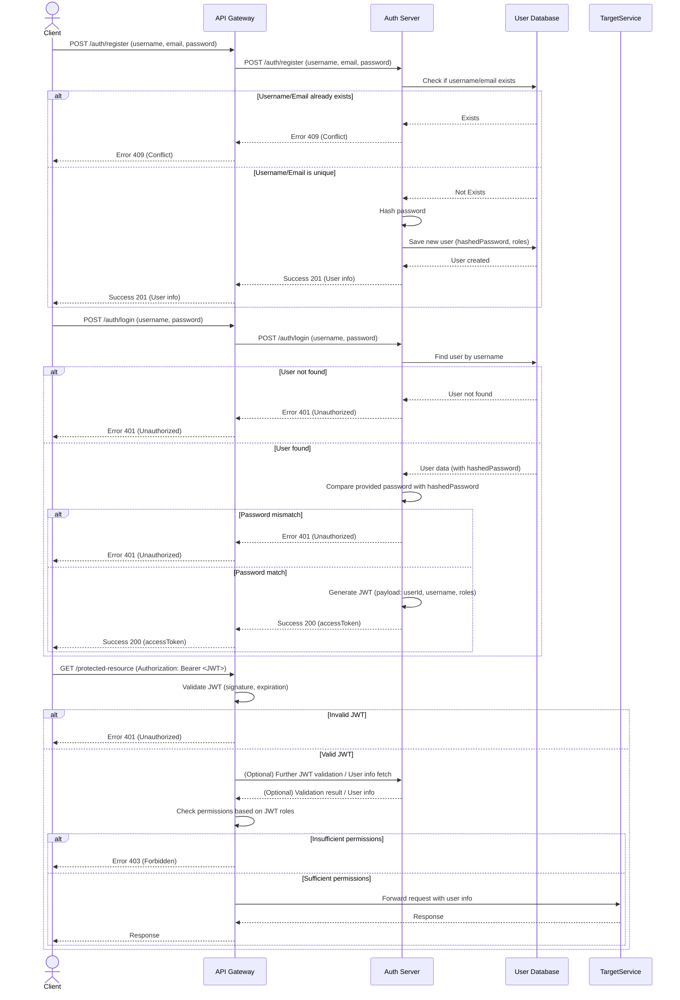

# Auth Server (Event Management Platform)

## 1. 개요

본 Auth Server는 이벤트 관리 플랫폼의 마이크로서비스 아키텍처(MSA) 구성 요소 중 하나로, 사용자 인증 및 권한 부여 기능을 전담합니다. 사용자의 회원 가입, 로그인 요청을 처리하고, 유효한 사용자에게는 JWT(JSON Web Token)를 발급하여 API 접근 권한을 제어합니다.

## 2. 주요 기능: 인증 및 역할 관리

### 2.1. 사용자 인증

- **회원 가입:**
  - 새로운 사용자를 시스템에 등록합니다.
  - 요청 시 `username`, `email`, `password`를 필수로 받습니다.
  - `password`는 `bcrypt`를 사용하여 안전하게 해싱되어 저장됩니다.
  - `username`과 `email`은 시스템 내에서 고유해야 합니다.
- **로그인:**
  - 등록된 사용자가 `username`과 `password`를 통해 시스템 접근 권한을 얻습니다.
  - 인증 성공 시, JWT (Access Token)가 발급됩니다.
- **JWT 기반 인증:**
  - 발급된 JWT는 이후 API 요청 시 `Authorization` 헤더에 `Bearer <TOKEN>` 형태로 포함되어야 합니다.
  - 서버는 JWT의 유효성을 검증하여 사용자를 식별하고 요청을 처리합니다.

### 2.2. 역할 관리 (Role-Based Access Control - RBAC)

- **사용자 역할 정의:**
  - 시스템 내 사용자 역할은 다음과 같이 정의됩니다. (`UserRole` Enum)
    - `USER`: 일반 사용자 (이벤트 참여, 보상 요청)
    - `OPERATOR`: 운영자 (이벤트 생성/관리, 보상 정의)
    - `AUDITOR`: 감사자 (보상 지급 내역 조회)
    - `ADMIN`: 시스템 관리자 (전체 사용자 관리, 시스템 설정 등 최상위 권한)
- **역할 할당:**
  - 회원 가입 시 `roles` 필드를 통해 사용자에게 하나 이상의 역할을 할당할 수 있습니다.
  - `roles` 필드가 제공되지 않으면 기본적으로 `USER` 역할이 할당됩니다. (구현 예정 또는 현재 로직 확인 필요)
- **역할 기반 권한 부여:**
  - 발급되는 JWT의 Payload에는 사용자의 역할 정보(`roles`)가 포함됩니다.
  - API Gateway 또는 각 마이크로서비스는 이 역할 정보를 바탕으로 특정 API 엔드포인트나 기능에 대한 접근을 제어합니다. (예: NestJS의 `RolesGuard` 활용)

## 3. API Endpoints (인증 관련)

### 3.1. `POST /auth/register`

- **설명:** 신규 사용자 계정을 생성합니다.
- **Request Body:** `CreateUserDto`
  ```json
  {
    "username": "testuser",
    "email": "test@example.com",
    "password": "password123",
    "roles": ["USER"] // Optional
  }
  ```
- **Success Response (201):** 생성된 사용자 정보 (비밀번호 제외)
- **Error Responses:**
  - `400 Bad Request`: 입력 값 유효성 오류
  - `409 Conflict`: 사용자 이름 또는 이메일 중복

### 3.2. `POST /auth/login`

- **설명:** 사용자 로그인을 처리하고 JWT를 발급합니다. (현재 `LocalAuthGuard` 미적용 상태)
- **Request Body:** `LoginDto`
  ```json
  {
    "username": "testuser",
    "password": "password123"
  }
  ```
- **Success Response (200):** Access Token
  ```json
  {
    "accessToken": "your.jwt.token"
  }
  ```
- **Error Responses:**
  - `400 Bad Request`: 입력 값 유효성 오류
  - `401 Unauthorized`: 사용자 이름 또는 비밀번호 불일치

## 4. 인증 흐름 다이어그램 (Mermaid)



## 5. 환경 변수 (인증/역할 관련)

- `MONGODB_URI`: MongoDB 연결 URI
- `MONGODB_DB_NAME`: 사용할 MongoDB 데이터베이스 이름
- `JWT_SECRET`: JWT 서명에 사용될 비밀 키
- `JWT_EXPIRES_IN`: JWT 만료 시간 (e.g., `3600s`, `1h`)

## 6. 설정 및 실행 방법

1. **의존성 설치:**
   ```bash
   cd apps/auth-server
   yarn install
   ```
2. **환경 변수 설정:**
   - `apps/auth-server` 디렉토리에 `.env.development` (또는 해당 환경의 `.env` 파일)을 생성하고 위 "5. 환경 변수" 섹션을 참고하여 값을 설정합니다.
3. **개발 모드 실행:**
   ```bash
   yarn start:dev
   ```

---

*이 문서는 Auth Server의 인증 및 역할 관리에 중점을 두고 작성되었습니다. 전체 프로젝트 설계 및 다른 서버에 대한 정보는 프로젝트 루트의 `README.md`를 참고하십시오.*
