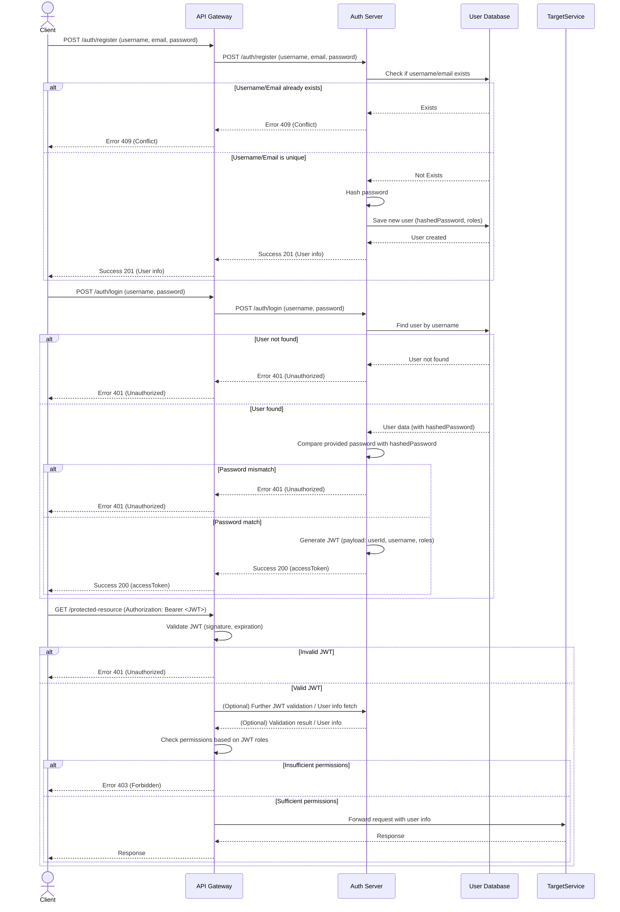

# Auth Server (Event Management Platform)

## 1. 개요

본 Auth Server는 이벤트 관리 플랫폼의 마이크로서비스 아키텍처(MSA) 구성 요소 중 하나로, 사용자 인증 및 권한 부여 기능을 전담합니다. 사용자의 회원 가입, 로그인 요청을 처리하고, 유효한 사용자에게는 JWT(JSON Web Token)를 발급하여 API 접근 권한을 제어합니다.

## 2. 주요 기능: 인증 및 역할 관리

### 2.1. 사용자 인증

- **회원 가입:**
  - 새로운 사용자를 시스템에 등록합니다.
  - 요청 시 `username`, `email`, `password`를 필수로 받습니다.
  - `password`는 `bcrypt`를 사용하여 안전하게 해싱되어 저장됩니다.
  - `username`과 `email`은 시스템 내에서 고유해야 합니다.
- **로그인:**
  - 등록된 사용자가 `username`과 `password`를 통해 시스템 접근 권한을 얻습니다.
  - 인증 성공 시, JWT (Access Token)가 발급됩니다.
- **JWT 기반 인증:**
  - 발급된 JWT는 이후 API 요청 시 `Authorization` 헤더에 `Bearer <TOKEN>` 형태로 포함되어야 합니다.
  - 서버는 JWT의 유효성을 검증하여 사용자를 식별하고 요청을 처리합니다.

### 2.2. 역할 관리 (Role-Based Access Control - RBAC)

- **사용자 역할 정의:**
  - 시스템 내 사용자 역할은 다음과 같이 정의됩니다. (`UserRole` Enum)
    - `USER`: 일반 사용자 (이벤트 참여, 보상 요청)
    - `OPERATOR`: 운영자 (이벤트 생성/관리, 보상 정의)
    - `AUDITOR`: 감사자 (보상 지급 내역 조회)
    - `ADMIN`: 시스템 관리자 (전체 사용자 관리, 시스템 설정 등 최상위 권한)
- **역할 할당:**
  - 회원 가입 시 `roles` 필드를 통해 사용자에게 하나 이상의 역할을 할당할 수 있습니다.
  - `roles` 필드가 제공되지 않으면 기본적으로 `USER` 역할이 할당됩니다. (구현 예정 또는 현재 로직 확인 필요)
- **역할 기반 권한 부여:**
  - 발급되는 JWT의 Payload에는 사용자의 역할 정보(`roles`)가 포함됩니다.
  - API Gateway 또는 각 마이크로서비스는 이 역할 정보를 바탕으로 특정 API 엔드포인트나 기능에 대한 접근을 제어합니다. (예: NestJS의 `RolesGuard` 활용)

## 3. API Endpoints (인증 관련)

### 3.1. `POST /auth/register`

- **설명:** 신규 사용자 계정을 생성합니다.
- **Request Body:** `CreateUserDto`
  ```json
  {
    "username": "testuser",
    "email": "test@example.com",
    "password": "password123",
    "roles": ["USER"] // Optional
  }
  ```
- **Success Response (201):** 생성된 사용자 정보 (비밀번호 제외)
- **Error Responses:**
  - `400 Bad Request`: 입력 값 유효성 오류
  - `409 Conflict`: 사용자 이름 또는 이메일 중복

### 3.2. `POST /auth/login`

- **설명:** 사용자 로그인을 처리하고 JWT를 발급합니다. (현재 `LocalAuthGuard` 미적용 상태)
- **Request Body:** `LoginDto`
  ```json
  {
    "username": "testuser",
    "password": "password123"
  }
  ```
- **Success Response (200):** Access Token
  ```json
  {
    "accessToken": "your.jwt.token"
  }
  ```
- **Error Responses:**
  - `400 Bad Request`: 입력 값 유효성 오류
  - `401 Unauthorized`: 사용자 이름 또는 비밀번호 불일치

## 4. 인증 흐름 다이어그램 (Mermaid)



## 5. 환경 변수 (인증/역할 관련)

- `MONGODB_URI`: MongoDB 연결 URI
- `MONGODB_DB_NAME`: 사용할 MongoDB 데이터베이스 이름
- `JWT_SECRET`: JWT 서명에 사용될 비밀 키
- `JWT_EXPIRES_IN`: JWT 만료 시간 (e.g., `3600s`, `1h`)

## 6. 설정 및 실행 방법

1. **의존성 설치:**
   ```bash
   cd apps/auth-server
   yarn install
   ```
2. **환경 변수 설정:**
   - `apps/auth-server` 디렉토리에 `.env.development` (또는 해당 환경의 `.env` 파일)을 생성하고 위 "5. 환경 변수" 섹션을 참고하여 값을 설정합니다.
3. **개발 모드 실행:**
   ```bash
   yarn start:dev
   ```

---

*이 문서는 Auth Server의 인증 및 역할 관리에 중점을 두고 작성되었습니다. 전체 프로젝트 설계 및 다른 서버에 대한 정보는 프로젝트 루트의 `README.md`를 참고하십시오.*

## 7. 향후 개선 및 고려 사항 (Auth Server)

* **세분화된 권한 관리 (Fine-grained Permissions):** 현재 `UserRole` 기반의 역할 분담을 넘어, 각 역할이 수행할 수 있는 특정 액션(예: `event:create`, `user:read`)에 대한 권한(Permission)을 정의하고, 역할에 이 권한들을 조합하여 할당하는 방식을 도입하여 더욱 세밀하고 유연한 접근 제어 시스템을 구축할 수 있습니다.
* **OAuth 2.0 / OpenID Connect (OIDC) 통합:** 소셜 로그인(Google, Kakao 등) 기능 또는 외부 IdP(Identity Provider)와의 연동을 지원하여 사용자 편의성을 높이고 다양한 인증 시나리오에 대응할 수 있습니다.
* **2단계 인증 (Two-Factor Authentication - 2FA):** 이메일, SMS, 또는 TOTP(시간 기반 일회용 비밀번호) 앱(예: Google Authenticator)을 이용한 2단계 인증을 추가하여 보안을 강화합니다.
* **리프레시 토큰 (Refresh Token) 관리 고도화:**
  * **리프레시 토큰 로테이션 (Rotation):** 리프레시 토큰 사용 시 새로운 리프레시 토큰을 발급하고 이전 것은 무효화하여 탈취 위험을 줄입니다.
  * **리프레시 토큰 블랙리스트/데이터베이스 저장:** 로그아웃 또는 특정 조건 발생 시 리프레시 토큰을 명시적으로 무효화할 수 있는 메커니즘을 구현합니다. (현재는 JWT 특성상 Stateless)
* **비밀번호 정책 강화:**
  * 최소 길이, 특수문자 포함 등 복잡도 요구사항 설정.
  * 비밀번호 만료 주기 설정 및 변경 강제.
  * 이전 비밀번호 재사용 금지.
* **계정 잠금 정책 (Account Lockout):** 로그인 시도 실패 횟수 제한 및 임시/영구 계정 잠금 기능을 구현하여 Brute-force 공격을 방어합니다.
* **감사 로그 (Audit Logging):** 주요 인증 이벤트(로그인 성공/실패, 회원가입, 비밀번호 변경, 역할 변경 등)에 대한 상세 로그를 기록하여 보안 감사 및 문제 추적에 활용합니다.
* **세션 관리 (선택 사항):** 필요시 서버 측 세션을 도입하여 특정 사용자의 세션을 강제로 만료시키는 등의 기능을 구현할 수 있으나, MSA 환경에서는 Stateless한 JWT를 유지하는 것이 일반적입니다.
* **테스트 커버리지 확대:** 인증 로직, 사용자 관리, 역할/권한 부여 등 핵심 기능에 대한 단위 테스트, 통합 테스트 코드를 더욱 촘촘하게 작성하여 시스템 안정성을 확보합니다.
* **성능 최적화:** 대규모 사용자 환경을 대비하여 인증/인가 처리 과정에서의 병목 지점(데이터베이스 쿼리, 토큰 생성 등)을 분석하고 최적화합니다. (예: 캐싱 전략 도입)
* **보안 강화 조치:**
  * 정기적인 보안 취약점 점검 및 패치.
  * 의존성 라이브러리 보안 업데이트 관리.
  * Rate Limiting을 Auth Server 자체에도 적용하여 무차별 대입 공격 방어.
  * 민감한 정보(예: 비밀번호 재설정 토큰) 전송 시 안전한 채널 사용 및 짧은 유효 기간 설정.

## 8. 트러블슈팅 (Auth Server)

Auth Server 개발 및 운영 과정에서 발생할 수 있는 주요 문제와 해결 방안입니다.

### 8.1. JWT 시크릿 불일치 (JWT Secret Mismatch)

* **문제 현상:** Gateway Server에서 Auth Server가 발급한 토큰을 검증하지 못하거나, 반대로 Auth Server가 Gateway를 통해 전달받은 (혹은 자신이 발급한) 토큰을 유효하지 않다고 판단하는 경우. `JsonWebTokenError: invalid signature` 등의 오류 발생.
* **원인 분석:** Auth Server와 Gateway Server (또는 토큰을 검증해야 하는 다른 서비스) 간에 `.env` 파일 등에 설정된 `JWT_SECRET` 환경 변수 값이 서로 다를 경우 발생합니다.
* **해결 방안:** 모든 관련 서비스의 `JWT_SECRET` 환경 변수 값이 **정확히 동일한지** 확인하고 일치시킵니다. 공백이나 특수문자 포함 여부도 주의 깊게 확인합니다.
* **예방 조치:** 중앙 설정 관리 시스템(예: HashiCorp Vault, Spring Cloud Config 등 - MSA 규모에 따라 고려)을 사용하거나, 배포 파이프라인에서 환경 변수를 일관되게 주입하는 방식을 고려합니다.

### 8.2. 토큰 만료 및 갱신 처리 미흡

* **문제 현상:** 클라이언트(사용자)가 Access Token 만료 후 API 요청 시 401 Unauthorized 오류를 받지만, 자동으로 토큰을 갱신하는 로직이 없거나 미흡하여 사용자가 불편을 겪는 경우.
* **원인 분석:** 클라이언트 측에서 Access Token 만료를 적절히 감지하고 Refresh Token을 사용하여 새로운 Access Token을 발급받는 로직이 구현되지 않았거나, Refresh Token 자체의 유효 기간 관리 문제.
* **해결 방안:**
  * **클라이언트:** Access Token 만료 시 (API 응답 401 확인) 자동으로 Refresh Token을 사용하여 새로운 Access Token을 요청하고, 이후 API 요청을 재시도하는 로직을 구현합니다.
  * **Auth Server:** Refresh Token을 안전하게 발급하고 관리하는 엔드포인트 (`/auth/refresh` 등)를 제공합니다. Refresh Token의 유효 기간은 Access Token보다 길게 설정합니다.
* **참고:** 리프레시 토큰 로테이션, 블랙리스트 등의 고급 전략은 "7. 향후 개선 및 고려 사항" 참조.

### 8.3. 사용자 자격 증명 오류 (Incorrect Credentials)

* **문제 현상:** 로그인 시 `username` 또는 `password`가 일치하지 않아 401 Unauthorized 응답을 받는 경우.
* **원인 분석:**
  * 사용자가 실제와 다른 `username` 또는 `password` 입력.
  * 회원가입 시 `username` 또는 `email` 중복 검사 로직 오류 또는 누락.
  * 데이터베이스 저장/조회 과정의 문제 (예: 대소문자 구분).
  * 비밀번호 해싱 및 비교 로직 오류.
* **해결 방안:**
  * 로그인 폼에서 사용자에게 명확한 오류 메시지 제공 (단, "아이디 또는 비밀번호가 틀립니다"와 같이 구체적인 불일치 항목은 숨기는 것이 보안상 권장됨).
  * `bcrypt.compare()` 등을 사용하여 해시된 비밀번호를 안전하게 비교하는지 확인.
  * 데이터베이스 쿼리 시 `username` 조회 조건 (대소문자 구분 여부 등) 확인.
* **디버깅 팁:** 로깅을 통해 특정 `username`으로 사용자 조회 시 결과가 어떻게 나오는지, 비밀번호 비교 로직에서 어떤 값들이 비교되는지 확인.

### 8.4. 데이터베이스 연결 문제

* **문제 현상:** Auth Server 시작 시 또는 운영 중 데이터베이스(MongoDB 등) 연결 실패로 서버가 비정상 종료되거나 API 요청 처리 불가.
* **원인 분석:**
  * `.env` 파일 내 `MONGODB_URI`, `MONGODB_DB_NAME` 등 연결 정보 오류.
  * 데이터베이스 서버 다운 또는 네트워크 문제.
  * 방화벽 설정으로 인한 접근 차단.
  * 데이터베이스 사용자 인증 정보(ID/PW) 오류.
* **해결 방안:**
  * Auth Server 로그에서 데이터베이스 연결 오류 메시지 확인.
  * 환경 변수 설정값 재확인.
  * 데이터베이스 서버 상태 및 네트워크 연결 상태 점검.
  * 데이터베이스 클라이언트 도구를 사용하여 직접 연결 테스트.
* **예방 조치:** 애플리케이션 시작 시 데이터베이스 연결을 확인하고, 연결 실패 시 재시도 로직 또는 정상 종료 처리 구현. `TerminusModule` 등을 활용한 헬스 체크 엔드포인트에 데이터베이스 연결 상태 점검 포함.

### 8.5. 역할/권한 설정 오류 및 접근 불가

* **문제 현상:** 특정 역할을 가진 사용자가 예상되는 API에 접근하지 못하거나, 반대로 접근해서는 안 되는 API에 접근 가능한 경우.
* **원인 분석:**
  * 회원가입 또는 사용자 정보 수정 시 역할(`roles`) 할당 로직 오류.
  * JWT 페이로드에 `roles` 정보가 누락되거나 잘못 포함된 경우.
  * Gateway Server 또는 리소스 서버의 `RolesGuard` 등 접근 제어 로직 설정 오류 (예: `@Roles()` 데코레이터 설정 누락 또는 잘못된 역할 지정).
* **해결 방안:**
  * 사용자 등록/수정 시 DB에 역할 정보가 올바르게 저장되는지 확인.
  * JWT 발급 시 페이로드에 정확한 `roles` 배열이 포함되는지 디버깅.
  * Gateway 및 각 리소스 서버의 Guard, `@Roles()` 데코레이터 설정 검토.
  * 단위/통합 테스트를 통해 다양한 역할 조합에 대한 접근 제어 시나리오 검증.

### 8.6. Gateway Server로부터 "request aborted" 또는 타임아웃

* **문제 현상:** Gateway Server가 Auth Server로 요청을 프록시했으나, Auth Server로부터 응답을 받지 못해 Gateway 측에서 타임아웃이 발생하거나 "request aborted" 오류가 기록되는 경우. (Gateway README의 트러블슈팅 7.3.과 연관)
* **원인 분석:**
  * **Auth Server 내부 로직 지연:** 특정 API (예: `/auth/login`, `/auth/register`) 처리 로직 내에서 과도한 시간이 소요되는 작업(복잡한 DB 쿼리, 외부 API 호출 지연, 무한 루프 등)으로 인해 Gateway의 타임아웃 시간 내에 응답을 보내지 못함.
  * **Auth Server 내부 오류 발생:** 요청 처리 중 예외가 발생했으나 적절히 처리되지 않아 응답을 보내지 못하고 멈추거나 비정상 종료되는 경우.
  * **환경 변수 설정 오류 (드문 경우):** Auth Server가 사용하는 다른 서비스(예: 이메일 서비스)의 URL 등이 잘못 설정되어 해당 부분에서 블로킹될 수 있음.
* **해결 방안:**
  * **상세 로깅:** Auth Server의 해당 API 핸들러 시작/끝 지점, 주요 로직 분기점, 외부 호출 지점 등에 상세한 타임스탬프 기반 로깅을 추가하여 병목 구간 식별.
  * **비동기 처리 검토:** 오래 걸리는 작업은 비동기적으로 처리하거나(예: 메시지 큐 사용), 응답 시간을 단축할 수 있도록 로직 최적화.
  * **오류 처리 강화:** 모든 코드 경로에서 발생 가능한 예외를 `try-catch`로 적절히 처리하고, 오류 발생 시 명확한 오류 응답을 클라이언트(Gateway)로 반환하도록 보장.
  * **타임아웃 설정 검토:** Gateway와 Auth Server 간의 HTTP 타임아웃 설정을 검토하고, 필요한 경우 합리적으로 조정. (단, 근본적인 응답 지연 해결이 우선)
  * **성능 프로파일링:** NestJS의 성능 모니터링 도구나 APM(Application Performance Monitoring) 솔루션을 사용하여 병목 지점 심층 분석.
* **교훈:** 마이크로서비스 간 통신에서 한쪽의 응답 지연은 다른 서비스의 타임아웃이나 예기치 않은 오류로 이어질 수 있으므로, 각 서비스는 신속하게 응답하거나 명확한 오류를 반환하는 것이 중요합니다. 디버깅 시에는 요청을 받은 서비스(Auth Server) 내부의 로그를 면밀히 확인하여 실제 문제 원인을 파악해야 합니다.

---
