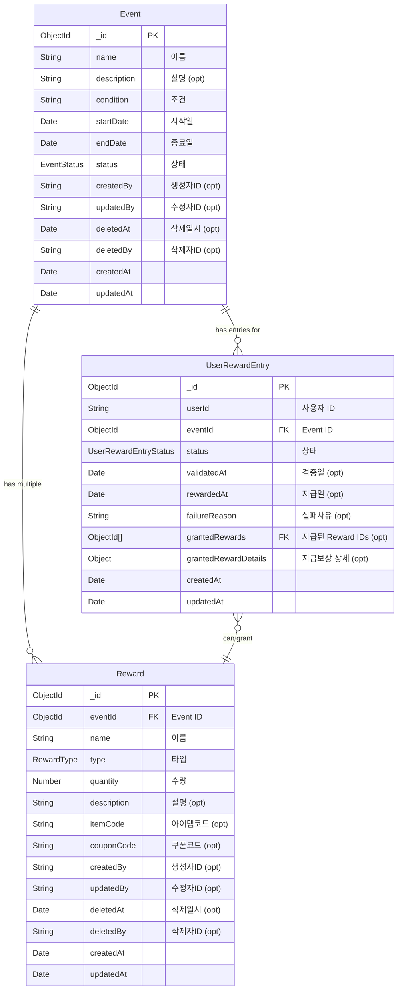

# Event Server (이벤트 보상 플랫폼)

본 Event Server는 이벤트 관리 플랫폼의 마이크로서비스 아키텍처(MSA) 구성 요소 중 하나로, 이벤트 생성/관리, 보상 정의, 사용자 이벤트 참여 및 보상 요청 처리 기능을 담당합니다. NestJS 프레임워크를 기반으로 하며 MongoDB를 데이터베이스로 사용합니다.

## 1. 주요 기능

*   **이벤트 관리 (`EventsModule`):**
    *   이벤트 생성, 조회 (페이지네이션, 필터링, 정렬), 수정, 논리적 삭제.
    *   이벤트 상태(`SCHEDULED`, `ACTIVE`, `ENDED`, `CANCELLED`) 관리 및 상태 전이 규칙 적용.
    *   생성자(`createdBy`), 수정자(`updatedBy`), 삭제자(`deletedBy`) 정보 기록.
*   **보상 관리 (`RewardsModule`):**
    *   특정 이벤트에 연동된 보상(포인트, 아이템, 쿠폰 등) 생성, 조회 (페이지네이션, 필터링-eventId/type, 정렬 지원), 수정, 논리적 삭제.
    *   보상 유형(`POINT`, `ITEM`, `COUPON`)에 따른 필요 필드(예: `itemCode`, `couponCode`) 관리.
    *   생성자(`createdBy`), 수정자(`updatedBy`), 삭제자(`deletedBy`) 정보 기록.
    *   연결된 이벤트의 상태에 따른 보상 생성/수정 제한.
*   **사용자 보상 요청 관리 (`UserRewardsModule`):**
    *   사용자의 이벤트 조건 달성 여부 검증 및 보상 요청 처리.
    *   보상 요청 상태(`REQUESTED`, `PENDING_VALIDATION`, `VALIDATION_FAILED`, `PENDING_PAYOUT`, `REWARDED`, `FAILED_PAYOUT`, `DUPLICATE_REQUEST`) 관리.
    *   중복 보상 요청 방지.
    *   사용자 본인 또는 운영자/감사자의 보상 요청/지급 이력 조회.

## 2. API Endpoints

*   전역 접두사: `/api/v1`
*   Swagger API 문서: `/api/v1/api-docs` (서버 실행 후 접근 가능)

### 2.1. Events API (`/api/v1/events`)

*   `POST /`: 새 이벤트 생성
*   `GET /`: 모든 이벤트 조회 (페이지네이션, 필터링, 정렬 지원)
*   `GET /:id`: 특정 이벤트 상세 조회
*   `PATCH /:id`: 특정 이벤트 수정
*   `DELETE /:id`: 특정 이벤트 논리적 삭제

### 2.2. Rewards API (`/api/v1/rewards`)

*   `POST /`: 새 보상 생성 (특정 이벤트에 연결)
*   `GET /`: 모든 보상 조회 (페이지네이션, 필터링-eventId/type, 정렬 지원)
*   `GET /:id`: 특정 보상 상세 조회
*   `PATCH /:id`: 특정 보상 수정
*   `DELETE /:id`: 특정 보상 논리적 삭제

### 2.3. UserRewards API (`/api/v1/user-rewards`)

*   `POST /claim`: 사용자의 이벤트 보상 요청
*   `GET /me`: 현재 사용자의 보상 요청 내역 조회 (페이지네이션, 필터링-eventId/status, 정렬 지원)
*   `GET /admin`: (운영자/관리자) 전체 사용자 보상 요청 내역 조회 (페이지네이션, 필터링-userId/eventId/status, 정렬 지원, `OPERATOR`/`AUDITOR`/`ADMIN` 역할 필요)

## 3. 데이터베이스 스키마 (MongoDB)

Event Server는 MongoDB를 데이터베이스로 사용하며, 주요 스키마는 다음과 같습니다.

### 3.1. `Event` 스키마 (`events` 컬렉션)

이벤트의 기본 정보를 저장합니다.

*   `_id`: `ObjectId` - MongoDB 기본 키
*   `name`: `String` - 이벤트 이름 (고유 값 권장)
*   `description`: `String` (Optional) - 이벤트 상세 설명
*   `condition`: `String` - 이벤트 참여 조건 또는 보상 달성 조건
*   `startDate`: `Date` - 이벤트 시작 일시
*   `endDate`: `Date` - 이벤트 종료 일시
*   `status`: `String` (Enum: `EventStatus` - `SCHEDULED`, `ACTIVE`, `ENDED`, `CANCELLED`) - 이벤트 현재 상태
*   `createdBy`: `String` (Optional) - 이벤트를 생성한 사용자 ID
*   `updatedBy`: `String` (Optional) - 이벤트를 마지막으로 수정한 사용자 ID
*   `deletedAt`: `Date` (Optional, default: `null`) - 논리적 삭제 일시 (null이면 삭제되지 않음)
*   `deletedBy`: `String` (Optional, default: `null`) - 이벤트를 삭제한 사용자 ID
*   `createdAt`: `Date` - 문서 생성 일시 (Mongoose `timestamps`)
*   `updatedAt`: `Date` - 문서 마지막 업데이트 일시 (Mongoose `timestamps`)
*   **주요 인덱스:**
    *   `{ name: 1, deletedAt: 1 }`
    *   `{ status: 1, startDate: -1, endDate: -1, deletedAt: 1 }`
    *   `{ endDate: 1, status: 1, deletedAt: 1 }`
    *   `{ deletedAt: 1 }`

### 3.2. `Reward` 스키마 (`rewards` 컬렉션)

이벤트에 연결된 개별 보상 정보를 저장합니다.

*   `_id`: `ObjectId` - MongoDB 기본 키
*   `eventId`: `ObjectId` (Ref: `Event`) - 연결된 이벤트의 `_id`
*   `name`: `String` - 보상 이름
*   `type`: `String` (Enum: `RewardType` - `POINT`, `ITEM`, `COUPON`) - 보상 타입
*   `quantity`: `Number` - 보상 수량
*   `description`: `String` (Optional) - 보상에 대한 추가 설명
*   `itemCode`: `String` (Optional) - `type`이 `ITEM`일 경우, 게임 내 아이템 식별 코드
*   `couponCode`: `String` (Optional) - `type`이 `COUPON`일 경우, 쿠폰 식별 코드
*   `createdBy`: `String` (Optional) - 보상을 생성한 사용자 ID
*   `updatedBy`: `String` (Optional) - 보상을 마지막으로 수정한 사용자 ID
*   `deletedAt`: `Date` (Optional, default: `null`) - 논리적 삭제 일시
*   `deletedBy`: `String` (Optional, default: `null`) - 보상을 삭제한 사용자 ID
*   `createdAt`: `Date` - 문서 생성 일시
*   `updatedAt`: `Date` - 문서 마지막 업데이트 일시
*   **주요 인덱스:**
    *   `{ eventId: 1, type: 1, deletedAt: 1 }`
    *   `{ type: 1, deletedAt: 1 }`
    *   `{ deletedAt: 1 }`

### 3.3. `UserRewardEntry` 스키마 (`user_reward_entries` 컬렉션)

사용자의 이벤트 참여 및 보상 요청/지급 상태를 기록합니다.

*   `_id`: `ObjectId` - MongoDB 기본 키
*   `userId`: `String` - 보상을 요청한 사용자의 ID
*   `eventId`: `ObjectId` (Ref: `Event`) - 참여/요청한 이벤트의 `_id`
*   `status`: `String` (Enum: `UserRewardEntryStatus`) - 요청 처리 상태
*   `validatedAt`: `Date` (Optional) - 조건 검증 완료 일시
*   `rewardedAt`: `Date` (Optional) - 보상 지급 완료 일시
*   `failureReason`: `String` (Optional) - 실패 사유
*   `grantedRewards`: `Array<ObjectId>` (Ref: `Reward`, Optional) - 지급된 `Reward`의 `_id` 목록
*   `grantedRewardDetails`: `Object` (Optional) - 지급된 보상의 상세 내용 스냅샷
*   `createdAt`: `Date` - 문서 생성 일시
*   `updatedAt`: `Date` - 문서 마지막 업데이트 일시
*   **주요 인덱스:** (변경 없음)
    *   `{ userId: 1, eventId: 1 }` (unique)
    *   `{ status: 1, updatedAt: -1 }`

### 3.4. 스키마 관계도 (ERD)



## 4. 모듈별 상세 설명

### 4.1. `EventsModule`

이벤트의 생성, 조회, 수정, 삭제 등 이벤트 자체의 생명주기를 관리합니다.

*   **주요 기능:**
    *   **생성 (`POST /`)**: `CreateEventDto`를 사용하여 새 이벤트 등록. `createdBy` 자동 설정. 날짜 유효성 검증.
    *   **전체 조회 (`GET /`)**: `FindAllEventsQueryDto`를 사용하여 페이지네이션, 필터링(이름, 상태, 시작/종료일 범위), 정렬 지원. 논리적으로 삭제되지 않은 이벤트만 조회.
    *   **단일 조회 (`GET /:id`)**: ID로 특정 이벤트 상세 정보 조회. 논리적으로 삭제되지 않은 이벤트만 조회.
    *   **수정 (`PATCH /:id`)**: `UpdateEventDto`를 사용하여 특정 이벤트 정보 수정. `updatedBy` 자동 설정. 상태 변경 시 정해진 규칙(예: `ENDED`->`ACTIVE` 불가) 적용. 날짜 유효성 검증. 논리적으로 삭제되지 않은 이벤트만 수정 가능.
    *   **삭제 (`DELETE /:id`)**: 특정 이벤트를 논리적으로 삭제 (`deletedAt`, `deletedBy` 필드 설정).
*   **주요 DTOs:**
    *   `CreateEventDto`: 이벤트 이름, 설명, 조건, 시작/종료일, 초기 상태 등.
    *   `UpdateEventDto`: `CreateEventDto`의 부분 집합.
    *   `FindAllEventsQueryDto`: 페이지, 제한, 정렬 기준/순서, 이름/상태/날짜 필터.
*   **주요 로직:**
    *   날짜 문자열 자동 `Date` 객체 변환 (서비스 레벨).
    *   Mongoose 스키마 레벨 `pre('save')` 훅을 통한 시작일/종료일 순서 유효성 검증.
    *   업데이트 시 서비스 레벨에서 상태 전이 유효성 및 날짜 순서 유효성 명시적 검증.

### 4.2. `RewardsModule`

각 이벤트에 연결될 수 있는 다양한 유형의 보상을 관리합니다.

*   **주요 기능:**
    *   **생성 (`POST /`)**: `CreateRewardDto`를 사용하여 특정 이벤트에 새 보상 등록. `createdBy` 자동 설정. 연결될 이벤트의 존재 및 상태(예: `ENDED`, `CANCELLED` 상태가 아님) 검증. 보상 유형(`POINT`, `ITEM`, `COUPON`)에 따른 `itemCode`, `couponCode` 필수 여부 및 조건부 유효성 검증.
    *   **전체 조회 (`GET /`)**: `FindAllRewardsQueryDto`를 사용하여 페이지네이션, 필터링(이벤트 ID, 보상 유형), 정렬 지원. 논리적으로 삭제되지 않은 보상만 조회. 연결된 이벤트 정보 일부(`name`, `status`)를 `populate`하여 함께 반환.
    *   **단일 조회 (`GET /:id`)**: ID로 특정 보상 상세 정보 조회. 논리적으로 삭제되지 않은 보상만 조회. 연결된 이벤트 정보 `populate`.
    *   **수정 (`PATCH /:id`)**: `UpdateRewardDto`를 사용하여 특정 보상 정보 수정. `updatedBy` 자동 설정. `eventId` 변경 시 새 이벤트 유효성/상태 검증. `type` 변경 시 관련 필드 유효성 검증. 연결된 이벤트가 `ENDED` 또는 `CANCELLED` 상태일 경우 주요 보상 내용 수정 제한. 논리적으로 삭제되지 않은 보상만 수정 가능.
    *   **삭제 (`DELETE /:id`)**: 특정 보상을 논리적으로 삭제 (`deletedAt`, `deletedBy` 필드 설정).
*   **주요 DTOs:**
    *   `CreateRewardDto`: 보상 이름, 유형, 수량, 설명(선택), 아이템/쿠폰 코드(유형 따라 선택/필수), 연결될 이벤트 ID.
    *   `UpdateRewardDto`: `CreateRewardDto`의 부분 집합.
    *   `FindAllRewardsQueryDto`: 페이지, 제한, 정렬 기준/순서, 이벤트 ID/보상 유형 필터.
*   **주요 로직:**
    *   `EventsService`를 주입받아 이벤트 관련 유효성 검증에 활용.
    *   MongoDB ObjectId 유효성 검증.

### 4.3. `UserRewardsModule`

사용자의 이벤트 참여 및 보상 획득 과정을 관리합니다.

*   **주요 기능:**
    *   **보상 요청 (`POST /claim`)**: `ClaimRewardDto` (`eventId`)를 사용하여 사용자가 특정 이벤트에 대한 보상을 요청합니다.
        *   요청 헤더의 `X-User-ID`를 통해 사용자 식별.
        *   이벤트 존재 여부 및 `ACTIVE` 상태 검증.
        *   동일 이벤트에 대한 사용자의 기존 요청(중복) 검증.
        *   `validateEventCondition` 메소드를 호출하여 이벤트 조건 충족 여부 검증 (현재는 항상 `true`를 반환하는 플레이스홀더, 향후 구체적인 조건 로직 구현 필요).
        *   조건 미충족 시 또는 연결된 보상이 없을 시 `VALIDATION_FAILED` 상태로 `UserRewardEntry` 기록.
        *   조건 충족 시, 이벤트에 연결된 모든 활성 보상을 조회하고, 이를 바탕으로 `grantedRewards` (ID 목록) 및 `grantedRewardDetails` (스냅샷)를 구성하여 `UserRewardEntry`를 `PENDING_PAYOUT` 상태로 생성 및 저장.
    *   **사용자 본인 보상 내역 조회 (`GET /me`)**: 로그인한 사용자가 자신의 보상 요청 기록을 조회합니다.
        *   요청 헤더의 `X-User-ID`를 통해 사용자 식별.
        *   `FindUserRewardsQueryDto`를 사용하여 페이지네이션(기본 10개씩), 정렬(기본 `createdAt` 내림차순), 필터링(이벤트 ID, 요청 상태) 기능 제공.
        *   조회 시 `eventId` 및 `grantedRewards` 필드를 `populate`하여 관련 이벤트 및 보상 정보의 일부를 함께 반환.
    *   **전체 보상 내역 조회 (`GET /admin`)**: 운영자/관리자가 모든 사용자의 보상 요청 기록을 조회합니다.
        *   `OPERATOR`, `AUDITOR`, `ADMIN` 역할 중 하나를 가진 사용자만 접근 가능 (RBAC 적용).
        *   `FindAllUserRewardEntriesQueryDto`를 사용하여 페이지네이션, 정렬, 필터링(사용자 ID, 이벤트 ID, 요청 상태) 기능 제공.
        *   조회 시 `eventId` 및 `grantedRewards` 필드를 `populate`.
*   **주요 DTOs:**
    *   `ClaimRewardDto`: `eventId: string` (MongoDB ObjectId 형식).
    *   `UserRewardEntryResponseDto`: `class-transformer` 데코레이터 (`@Expose`, `@Transform`, `@Type`)를 사용하여 응답 객체 구성. `_id`, `eventId`, `grantedRewards`의 `ObjectId`는 문자열로 변환.
    *   `FindUserRewardsQueryDto`: `page`, `limit`, `sortBy`, `sortOrder`, `eventId?`, `status?`.
    *   `FindAllUserRewardEntriesQueryDto`: `FindUserRewardsQueryDto` 필드에 `userId?` 필터 추가.
*   **주요 로직:**
    *   `UserRewardsService`에서 비즈니스 로직 처리.
    *   `UserRewardsController`에서 요청 처리 및 `ClassSerializerInterceptor`와 `plainToInstance`를 사용한 DTO 자동 변환.
    *   MongoDB ObjectId 유효성 검증 (`IsMongoId` 데코레이터, `new Types.ObjectId()` 변환).
    *   `EventModel` 및 `RewardModel`을 사용하여 관련 데이터 조회 및 검증.
    *   역할 기반 접근 제어(RBAC)를 위해 `@Roles()` 데코레이터 및 `RolesGuard` 사용 (`/admin` 엔드포인트).

## 5. 환경 변수

Event Server 실행에 필요한 주요 환경 변수는 다음과 같습니다. 상세 내용은 `apps/event-server/.env.example` 파일을 참고하십시오.

*   `EVENT_SERVER_PORT`: Event Server 실행 포트 (기본값: 3002)
*   `EVENT_MONGODB_URI`: MongoDB 연결 URI
*   `EVENT_MONGODB_DB_NAME`: 사용할 MongoDB 데이터베이스 이름
*   `JWT_SECRET`: JWT 검증을 위한 비밀 키 (Gateway Server, Auth Server와 동일해야 함)

## 6. 설정 및 실행 방법 (기본)

1.  **의존성 설치:**
    ```bash
    # 프로젝트 루트에서 전체 의존성 설치 (최초 1회 또는 필요시)
    # yarn install

    # Event Server 개별 의존성 설치 (필요시)
    cd apps/event-server
    yarn install
    ```
2.  **환경 변수 설정:**
    *   `apps/event-server` 디렉토리에 `.env.development` (또는 해당 환경의 `.env` 파일)을 생성하고 위 "5. 환경 변수" 섹션을 참고하여 값을 설정합니다. (MongoDB URI, DB 이름, JWT 시크릿 등)
3.  **개발 모드 실행:**
    ```bash
    # apps/event-server 디렉토리에서 실행
    yarn start:dev event-server
    ```
    또는 프로젝트 루트에서:
    ```bash
    yarn start:dev event-server
    ```
    서버가 정상적으로 실행되면 설정된 포트(기본 3002)로 API 요청을 받을 수 있습니다. Swagger UI는 `/api/v1/api-docs` 경로에서 접근 가능합니다.

## 7. 향후 개선 및 고려 사항

*   **`UserRewardsModule` 추가 기능**:
    *   `validateEventCondition` 메소드의 실제 조건 검증 로직 구체화 (사용자 데이터 연동 등).
    *   `payoutRewards` 메소드의 실제 보상 지급 로직 구현 (상태 업데이트, 외부 시스템 연동).
*   **트랜잭션 관리**: 여러 DB 작업이 포함되는 로직(예: 사용자 보상 지급 시 상태 업데이트 및 보상 내역 기록)에 대해 MongoDB 트랜잭션을 적용하여 데이터 일관성 보장.
*   **메시지 큐 연동 (선택 사항)**: 보상 지급과 같이 시간이 오래 걸리거나 외부 시스템 연동이 필요한 작업은 메시지 큐(예: RabbitMQ, Kafka)를 통해 비동기 처리하여 응답성 향상 및 시스템 안정성 증대.
*   **테스트 커버리지 확대**: 각 모듈의 서비스 로직, 컨트롤러, DTO 유효성 검사 등에 대한 단위 테스트 및 통합 테스트 코드 작성.
*   **로깅 상세화**: Winston, Pino 등 전문 로깅 라이브러리 도입 및 요청 ID(Correlation ID) 기반 로깅으로 MSA 환경에서의 추적 용이성 확보.
*   **보안 강화**: 입력값 검증 강화, 인가 로직 세분화, 주요 작업에 대한 감사 로그 기록.
*   **성능 최적화**: DB 쿼리 최적화, 필요한 곳에 캐싱 전략 도입.

## 8. 트러블슈팅

# Event Server - 실무 트러블슈팅 & 경험 정리

## 1. JWT 인증/인가와 req.user
- event-server도 Gateway와 별도로 JwtAuthGuard, JwtStrategy를 적용하여 JWT 인증을 독립적으로 수행해야 함(MSA 실무 표준).
- req.user가 undefined인 경우, JwtAuthGuard가 누락되었거나, 인증 미들웨어가 정상 동작하지 않는 상황임을 빠르게 진단.

## 2. Guard/Role 인가
- RolesGuard에서 req.user.roles와 @Roles() 데코레이터의 값을 비교하여 인가를 수행.
- JwtAuthGuard가 반드시 먼저 실행되어야 req.user가 할당됨.
- APP_GUARD로 전역 등록하여 모든 API에 일관성 있게 적용.

## 3. 프록시 구조와 내부 서비스 연동
- Gateway에서 Authorization 헤더를 그대로 전달받아 event-server에서 다시 JWT 인증을 수행해야 보안이 유지됨.
- Gateway에서 인증을 했더라도, event-server가 Authorization 헤더를 받아서 다시 인증하지 않으면 req.user가 undefined가 됨.

## 4. DTO/ValidationPipe
- DTO에 class-validator 데코레이터가 없으면 ValidationPipe에서 property should not exist 에러가 발생함.
- Swagger 문서화와 DTO 검증을 동시에 만족시키기 위해 @ApiProperty, @IsString 등 데코레이터를 병행 사용.

## 5. 실무적 방어코드/에러 처리
- req.user가 undefined일 때 401 Unauthorized를 반환하도록 방어코드 작성.
- 프록시 서비스에서 req가 undefined일 때 명확한 에러 메시지로 빠르게 원인 진단.

## 6. 실무적 MSA 구조
- Gateway, event-server, auth-server 등 모든 서비스가 독립적으로 JWT 인증/인가를 수행해야 보안과 확장성이 보장됨.
- 인증/인가 로직, DTO, 에러 처리 등 모든 레이어에서 일관성 있게 실무 패턴 적용.

---
면접에서 위 이슈와 해결 경험, 실무적 패턴을 명확히 설명할 수 있도록 준비!