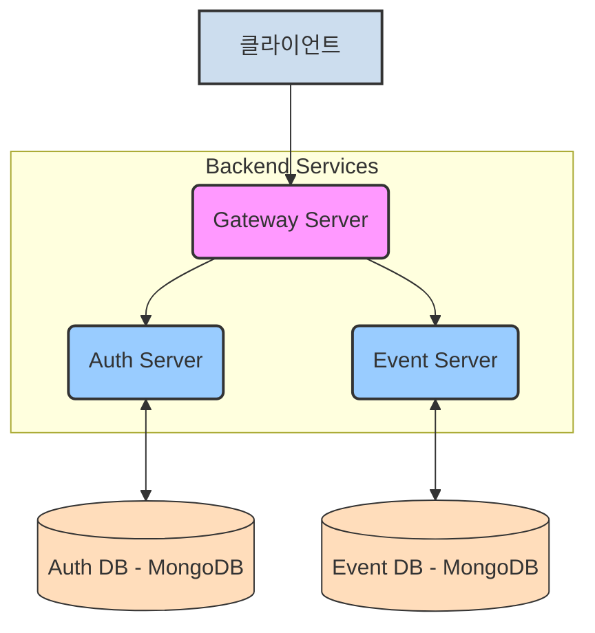
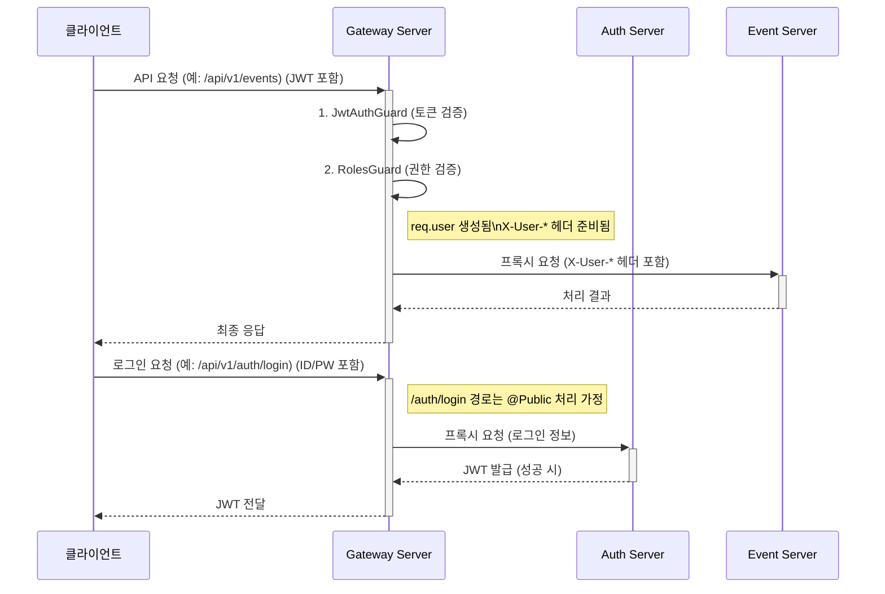

# Gateway Server (이벤트 보상 플랫폼)

본 서버는 이벤트 보상 플랫폼 마이크로서비스 아키텍처의 API Gateway 역할을 수행합니다. 모든 외부 클라이언트 요청의 진입점(Entry Point)으로서, 인증(Authentication), 인가(Authorization), 요청 라우팅(Request Routing), API 문서화, 상태 확인 등 공통 관심사를 처리합니다.

## 1. 시스템 내 위치 및 구성

Gateway Server는 클라이언트와 내부 마이크로서비스(Auth Server, Event Server 등) 사이의 중계자 역할을 합니다.



## 2. 주요 기능 및 동작 방식

### 2.1. API 진입점

* 모든 외부 요청은 Gateway Server의 `/api/v1` 전역 접두사를 통해 시스템으로 진입합니다.
* API 문서는 Swagger UI를 통해 `/api/v1/api-docs` 경로에서 확인할 수 있습니다.

### 2.2. 인증 및 인가 (Authentication & Authorization)

Gateway Server는 모든 요청에 대해 전역적으로 다음의 Guard를 순차적으로 적용하여 인증 및 인가를 처리합니다.

* **`JwtAuthGuard` (JWT 기반 인증)**:
  * 요청 헤더의 `Authorization: Bearer <토큰>`에서 JWT를 추출합니다.
  * 환경 변수 `JWT_SECRET`을 사용하여 토큰의 서명 및 만료 시간을 검증합니다.
  * 검증에 성공하면, 토큰 페이로드에 담긴 사용자 정보(userId, username, roles)를 `req.user` 객체에 첨부하여 다음 Guard나 핸들러로 전달합니다.
  * 컨트롤러나 특정 핸들러 메소드에 `@Public()` 데코레이터가 적용된 경우, 이 인증 과정을 건너뛰어 공개적으로 접근 가능한 엔드포인트를 설정할 수 있습니다.
    * 예시: `AppController`의 `login`, `register`, `healthCheck` 핸들러는 `@Public()`으로 지정되어 인증 없이 접근 가능합니다.
* **`RolesGuard` (역할 기반 접근 제어 - RBAC)**:
  * `JwtAuthGuard`가 성공적으로 통과된 후 실행됩니다.
  * 엔드포인트에 `@Roles(UserRole.ADMIN, UserRole.OPERATOR, ...)` 데코레이터로 접근에 필요한 역할(들)이 명시되어 있는지 확인합니다.
  * `req.user` 객체에 있는 사용자의 역할(`user.roles`)과 엔드포인트에 필요한 역할을 비교합니다.
  * 사용자가 필요한 역할을 하나라도 가지고 있지 않으면 `ForbiddenException` (403 에러)을 발생시켜 접근을 차단합니다.
  * `@Roles()` 데코레이터가 엔드포인트에 적용되지 않은 경우, 역할 검사를 수행하지 않고 통과시킵니다 (즉, 인증된 사용자는 누구나 접근 가능).

### 2.3. 요청 라우팅 및 프록시 (Request Routing & Proxying)

* **Public 경로 처리**:
  * `/api/v1/auth/login`, `/api/v1/auth/register` (POST 요청) 및 `/api/v1/` (루트 경로, GET 요청) 경로는 `AppController`에 명시적인 핸들러로 정의되어 있으며, `@Public()` 데코레이터가 적용되어 인증 절차를 건너뜁니다. 이들 요청은 `AppController`의 `handleProxy` 메소드 (또는 직접 응답)를 통해 처리됩니다.
  * `/api/v1/health` (GET 요청) 경로는 `HealthController`를 통해 처리되며, `@Public()` 데코레이터가 적용되어 인증 없이 접근 가능합니다.
* **기타 모든 요청**:
  * 위에서 언급된 Public 경로를 제외한 모든 요청은 `AppController`의 와일드카드 라우트 (`@All('*') proxyAllOtherRequests`)를 통해 처리됩니다.
  * 이 핸들러에는 `@Public()` 데코레이터가 없으므로, 전역으로 등록된 `JwtAuthGuard` 및 `RolesGuard`가 적용됩니다.
  * 인증 및 인가 검사를 통과한 요청은 `AppService`의 `proxyRequest` 메소드로 전달되어 내부 마이크로서비스로 라우팅됩니다.
* `proxyRequest` (또는 `handleProxy`를 통해 간접적으로) 메소드는 수신된 요청의 URL (`originalUrl`)을 분석합니다:
  * `/api/v1/auth/**` 패턴의 요청은 환경 변수 `AUTH_SERVER_URL`에 지정된 Auth Server로 프록시됩니다.
  * `/api/v1/events/**` 패턴의 요청은 환경 변수 `EVENT_SERVER_URL`에 지정된 Event Server로 프록시됩니다.
* 하위 마이크로서비스로 요청을 전달할 때, 기존 클라이언트 헤더와 함께 다음과 같은 커스텀 헤더를 추가하여 인증된 사용자 정보를 전파합니다:
  * `X-User-Id`: 인증된 사용자의 ID (UUID 또는 MongoDB ObjectId)
  * `X-User-Username`: 인증된 사용자의 이름
  * `X-User-Roles`: 인증된 사용자의 역할 목록 (콤마로 구분된 문자열, 예: "USER,OPERATOR")
    이를 통해 하위 서비스는 자체적으로 토큰을 다시 검증할 필요 없이 요청 컨텍스트에서 사용자 정보를 신뢰하고 활용할 수 있습니다.
* `AppService`의 `proxyRequest` 메소드에서는 하위 서비스로 실제 요청을 보내기 전에 대상 서비스, URL, 메소드 및 요청 본문(존재하는 경우)을 로깅하여 디버깅 편의성을 높였습니다. 또한, 프록시 시 불필요하거나 문제를 유발할 수 있는 `content-length` 헤더를 제거합니다.

### 2.4. 상태 확인 엔드포인트

* **간단한 루트 경로 확인**: Gateway Server의 루트 경로 (`/api/v1/`)로 `GET` 요청 시, 간단한 환영 메시지와 함께 API 문서 및 상세 헬스 체크 엔드포인트 경로를 안내하는 JSON 응답을 반환합니다. 이 경로는 `AppController`의 `gatewayRoot` 메소드를 통해 처리되며, `@Public()` 데코레이터가 적용되어 인증 없이 접근 가능합니다.
* **상세 헬스 체크**: `/api/v1/health` 경로로 `GET` 요청 시, `@nestjs/terminus`를 사용하여 Gateway Server 자체의 상태(메모리, 디스크 공간) 및 연결된 주요 하위 서비스(Auth Service, Event Service)의 HTTP 응답 가능 여부를 종합적으로 확인하여 상태 정보를 반환합니다. 이 엔드포인트는 `@Public()`으로 지정되어 인증 없이 접근 가능합니다.

## 3. 주요 요청 흐름 예시 (Mermaid)



## 4. 환경 변수

본 Gateway Server를 실행하기 위해 다음과 같은 환경 변수 설정이 필요합니다. `.env.example` 파일을 참조하여 `.env.development` 또는 `.env.production` 파일을 생성하고 값을 설정하십시오.

* `PORT`: Gateway Server가 실행될 포트 번호 (기본값: 3000)
* `JWT_SECRET`: JWT 서명 및 검증에 사용될 비밀 키. **반드시 Auth Server와 동일한 값으로 설정해야 합니다.**
* `AUTH_SERVER_URL`: Auth Server의 전체 URL (예: `http://localhost:3001/api/v1`)
* `EVENT_SERVER_URL`: Event Server의 전체 URL (예: `http://localhost:3002/api/v1`)
* `HTTP_TIMEOUT` (선택 사항): 하위 서비스로의 HTTP 요청 타임아웃 (밀리초 단위, 기본값: 5000)
* `HTTP_MAX_REDIRECTS` (선택 사항): 하위 서비스로의 HTTP 요청 시 최대 리다이렉션 횟수 (기본값: 5)

## 5. 실행 방법

1. **의존성 설치**:
   프로젝트 루트 디렉토리 및 `apps/gateway-server` 디렉토리에서 다음 명령어를 실행합니다.

   ```bash
   # 프로젝트 루트에서 전체 의존성 설치 (최초 1회 또는 필요시)
   # yarn install

   # Gateway Server 개별 의존성 설치 (필요시)
   cd apps/gateway-server
   yarn install
   ```
2. **환경 변수 설정**:
   `apps/gateway-server` 디렉토리에 `.env.development` 또는 `.env.production` 파일을 생성하고 위 "4. 환경 변수" 섹션을 참고하여 값을 설정합니다.
3. **서버 실행**:
   `apps/gateway-server` 디렉토리에서 다음 명령어를 실행합니다.

   ```bash
   # 개발 모드 (파일 변경 감지 및 자동 재시작)
   yarn start:dev

   # 운영 모드 (빌드 후 실행)
   # yarn build
   # yarn start:prod
   ```

   서버가 정상적으로 실행되면 콘솔에 다음 메시지들이 출력됩니다:
   * `✅ 게이트웨이 서버가 다음 주소에서 실행 중입니다: http://localhost:[PORT]/api/v1`
   * `✅ 게이트웨이 서버 Swagger UI는 다음 주소에서 확인 가능합니다: http://localhost:[PORT]/api/v1/api-docs`

## 6. 향후 개선 및 고려 사항 (Gateway Server)

* **Public 경로 명시적 처리 및 라우팅**: (개선됨) `AppController`에 Public 경로 핸들러를 명시적으로 추가하고, `HealthController`를 위한 `/api/v1/health` 경로를 `AppModule`의 `RouterModule` 설정을 통해 와일드카드 라우트보다 우선적으로 처리되도록 조정했습니다.
* **API 문서화 (Swagger/OpenAPI)**: (구현됨) `@nestjs/swagger`를 사용하여 API 문서를 자동 생성하고 `/api/v1/api-docs`를 통해 UI를 제공합니다. 로그인 요청 본문에 대한 스키마도 `@ApiBody`를 통해 명시했습니다.
* **확장된 헬스 체크**: (구현됨) `@nestjs/terminus`를 사용하여 Gateway 자체 및 하위 서비스의 상태를 점검하는 `/api/v1/health` 엔드포인트를 제공합니다.
* **요청/응답 로깅**: (일부 구현됨) `AppService`에서 프록시 대상 URL 및 요청 본문을 로깅합니다. 향후 Winston 또는 Pino와 같은 전문 로거 도입 및 요청 ID(Correlation ID)를 사용한 로깅 강화를 고려할 수 있습니다.
* **테스트 코드**: `JwtAuthGuard`, `RolesGuard`, 프록시 로직(`AppService`, `AppController`), `HealthController` 등 핵심 기능에 대한 단위 테스트 및 통합 테스트 코드를 작성하여 안정성을 높입니다.
* **프록시 모듈화**: 현재 `AppService`에 통합된 프록시 로직을 각 마이크로서비스별 프록시 모듈(예: `AuthProxyModule`, `EventProxyModule`)로 분리하여 코드의 응집도를 높이고 유지보수성을 개선합니다.
* **API 속도 제한 (Rate Limiting)**: `@nestjs/throttler` 등을 사용하여 DoS/DDoS 공격으로부터 시스템을 보호하고 서비스 안정성을 확보합니다.
* **서킷 브레이커 패턴**: 하위 서비스의 장애가 Gateway 전체로 전파되는 것을 막기 위해 서킷 브레이커 패턴(예: `@nestjs/terminus`와 연계) 도입을 고려합니다.

## 7. 트러블슈팅

개발 과정에서 발생했던 주요 문제 및 해결 과정입니다.

### 7.1. `/api/v1/health` 경로 `@Public()` 미작동 및 인증 오류

*   **문제 현상**: `HealthController`의 `check` 메소드에 `@Public()` 데코레이터를 적용했음에도 불구하고, 해당 경로로 요청 시 `JwtAuthGuard`에서 인증 토큰이 없다는 이유로 401 Unauthorized 에러 발생.
*   **원인 분석**:
    1.  `AppController`에 정의된 `@All('*')` 와일드카드 라우트가 `HealthController`의 `/health` 경로보다 먼저 요청을 가로채고 있었음.
    2.  `AppController`의 와일드카드 핸들러에는 `@Public()`이 적용되지 않았으므로, `JwtAuthGuard`와 `RolesGuard`가 인증/인가를 시도함.
    3.  `Reflector`가 현재 실행 컨텍스트(와일드카드 핸들러)에서 `IS_PUBLIC_KEY` 메타데이터를 찾지 못해 `isPublic` 플래그가 `undefined`로 평가됨.
*   **해결 과정**:
    1.  `JwtAuthGuard` 및 `RolesGuard`에 상세 로깅을 추가하여 컨트롤러/핸들러 매칭 상태 및 `@Public()` 메타데이터 인식 여부 확인.
    2.  `RolesGuard`가 `@Public()` 경로를 올바르게 건너뛸 수 있도록 수정 (초기에 `JwtAuthGuard` 문제로 오인 가능성 있었음).
    3.  `AppModule`에서 `RouterModule.register`를 사용하여 `/health` 경로를 `HealthModule`로 명시적으로 라우팅하도록 설정.
        *   초기 시도: `HealthController`의 `@Controller('health')`와 `RouterModule`의 `path: 'health'`가 중복되어 `/api/v1/health/health`로 라우팅되는 문제 발생.
        *   수정: `HealthController`를 `@Controller()`로 변경하여 `RouterModule`에서 정의한 경로를 사용하도록 함.
    4.  `AppModule`의 `imports` 배열에서 `HealthModule` 및 `RouterModule.register` 설정을 다른 모듈들보다 앞 순서로 배치하여, `/health` 경로가 `AppController`의 와일드카드 라우트보다 먼저 매칭될 수 있도록 우선순위 조정.
*   **교훈**: NestJS의 라우팅 우선순위를 이해하고, 특정 경로가 와일드카드에 의해 가려지지 않도록 명시적인 라우팅 설정을 사용하거나 모듈 임포트 순서를 신중히 고려해야 함. Guard 내에서 현재 컨텍스트(컨트롤러, 핸들러)를 정확히 로깅하는 것이 디버깅에 중요.

### 7.2. 로그인 API (`/api/v1/auth/login`) 프록시 시 Auth Server에서 400 Bad Request

*   **문제 현상**: Gateway를 통해 로그인 API 호출 시 Auth Server로부터 400 에러 응답. `@Public()` 데코레이터는 정상 작동.
*   **원인 분석**: 클라이언트(Postman)에서 Gateway로 로그인 요청 시 요청 본문(username, password)을 포함하지 않음. Gateway는 빈 본문을 Auth Server로 전달했고, Auth Server는 필수 자격 증명 필드 누락으로 400 에러 반환.
*   **해결 과정**:
    1.  Gateway의 `AppService.proxyRequest` 로직에서 요청 본문(`req.body`)이 `axiosConfig.data`로 정상 전달되는지 코드 확인 (정상이었음).
    2.  클라이언트에서 요청 본문에 `username`과 `password`를 JSON 형식으로 올바르게 포함하여 전송하도록 안내.
    3.  Swagger UI에서 요청 본문 명세를 쉽게 확인하고 테스트할 수 있도록 `AppController`의 `login` 메소드에 `@ApiBody` 데코레이터 추가.
*   **교훈**: 프록시 관련 문제 시, 프록시 서버 자체의 로직뿐만 아니라 클라이언트의 요청과 최종 목적지 서버의 요구사항까지 전체 흐름을 확인해야 함. API 문서화 도구(`@ApiBody` 등)를 활용하면 클라이언트 개발/테스트에 도움.

### 7.3. 로그인 API 프록시 시 Auth Server 타임아웃 또는 "request aborted"

*   **문제 현상**: Gateway에서 로그인 API 호출 시 Auth Server로부터 응답이 없어 5초 후 타임아웃 발생 (Gateway 로그). 동시에 Auth Server 로그에는 "request aborted" 에러 기록.
*   **원인 분석**:
    1.  **초기 원인**: Gateway의 `.env` 파일에 설정된 `AUTH_SERVER_URL` 환경 변수 값이 실제 Auth Server 주소와 일치하지 않아 요청이 제대로 도달하지 못함.
    2.  **`.env` 수정 후 원인**: Auth Server 내부 로직의 응답 지연 또는 심각한 오류로 인해, Gateway에서 설정한 타임아웃 내에 Auth Server가 응답을 생성하지 못함. Gateway가 타임아웃으로 연결을 먼저 끊자, 요청 본문을 읽고 있던 Auth Server에서 "request aborted" 에러 발생.
*   **해결 과정**:
    1.  Gateway의 `.env` 파일에서 `AUTH_SERVER_URL`을 올바른 Auth Server 주소로 수정.
    2.  Gateway의 `AppService.proxyRequest`에 프록시 대상 URL 및 요청 정보를 로깅하는 코드 추가하여, 요청이 올바른 주소로 전달되는지 확인.
    3.  문제의 초점을 Auth Server의 내부 응답 생성 로직으로 이동. (사용자가 Auth Server 측의 문제를 해결한 것으로 가정)
    4.  (디버깅 중 임시 조치) Gateway의 `HttpModule` 타임아웃 설정을 늘려 Auth Server가 응답할 시간을 더 확보.
*   **교훈**: 마이크로서비스 간 통신 문제 발생 시, 각 서비스의 환경 변수 설정, 네트워크 경로, 그리고 각 서비스 내부의 로그를 면밀히 확인해야 함. 한쪽 서비스의 타임아웃은 다른 쪽 서비스의 예기치 않은 에러(예: "request aborted")를 유발할 수 있으므로 연관 관계를 파악하는 것이 중요.

---

# Gateway Server - 실무 트러블슈팅 & 경험 정리

## 1. JWT 인증/인가와 req.user
- Gateway에서 JwtAuthGuard, JwtStrategy를 통해 JWT 인증을 수행하고, req.user에 사용자 정보를 할당해야 RolesGuard 등에서 정상적으로 인가가 동작함.
- JwtStrategy의 validate()에서 반드시 userId, username, roles를 반환해야 req.user가 생성됨.
- req.user가 undefined인 경우, 인증 미들웨어가 누락되었거나, JWT가 잘못된 경우임을 빠르게 진단.

## 2. 프록시 구조와 내부 서비스 연동
- Gateway에서 인증/인가 후 event-server, auth-server 등으로 프록시할 때 Authorization 헤더를 그대로 전달해야 내부 서비스에서도 JWT 인증이 가능함.
- 내부 서비스도 반드시 JWT 인증을 별도로 수행해야 보안이 유지됨(MSA 실무 표준).

## 3. DTO/ValidationPipe
- DTO에 class-validator 데코레이터가 없으면 ValidationPipe에서 property should not exist 에러가 발생함.
- Swagger 문서화와 DTO 검증을 동시에 만족시키기 위해 @ApiProperty, @IsString 등 데코레이터를 병행 사용.

## 4. req.user와 x-user-id의 차이
- 실무에서는 인증/인가/데이터 접근 제어는 반드시 req.user 기반으로 처리해야 하며, x-user-id 등 커스텀 헤더는 내부 시스템 간 부가 정보로만 활용.
- Gateway에서 인증 후 내부 서비스로 프록시할 때 x-user-id, x-user-roles 등 헤더를 추가할 수 있으나, 보안상 신뢰하지 않음.

## 5. Guard/Role 인가
- RolesGuard에서 req.user.roles와 @Roles() 데코레이터의 값을 비교하여 인가를 수행.
- JwtAuthGuard가 먼저 실행되어 req.user가 반드시 할당되어야 함.
- 실무적으로는 APP_GUARD로 전역 등록하여 모든 API에 일관성 있게 적용.

## 6. 실무적 방어코드/에러 처리
- req.user가 undefined일 때 401 Unauthorized를 반환하도록 방어코드 작성.
- 프록시 서비스에서 req가 undefined일 때 명확한 에러 메시지로 빠르게 원인 진단.

## 7. MSA 구조의 인증/인가 실무 패턴
- Gateway, event-server, auth-server 등 모든 서비스가 독립적으로 JWT 인증/인가를 수행해야 보안과 확장성이 보장됨.
- Gateway에서 인증을 했더라도, 내부 서비스는 Authorization 헤더를 받아서 다시 인증.

