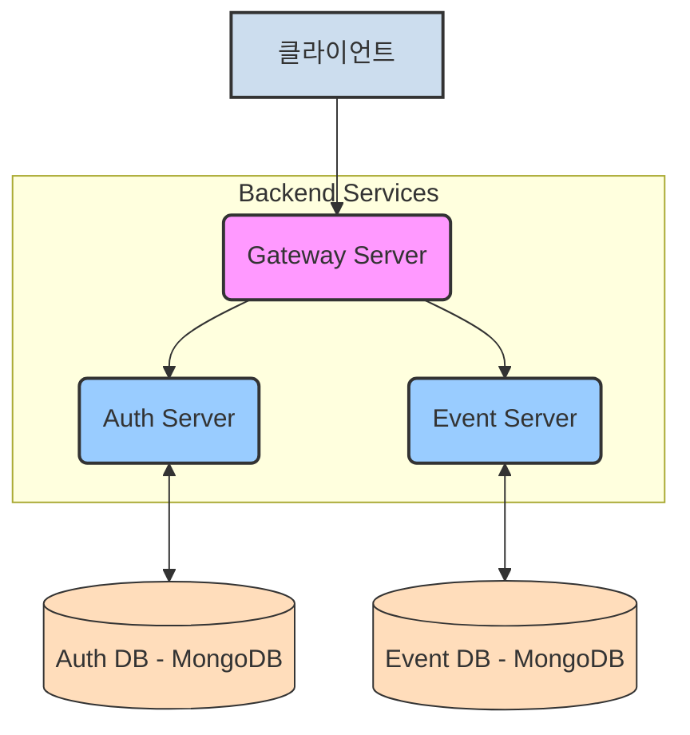
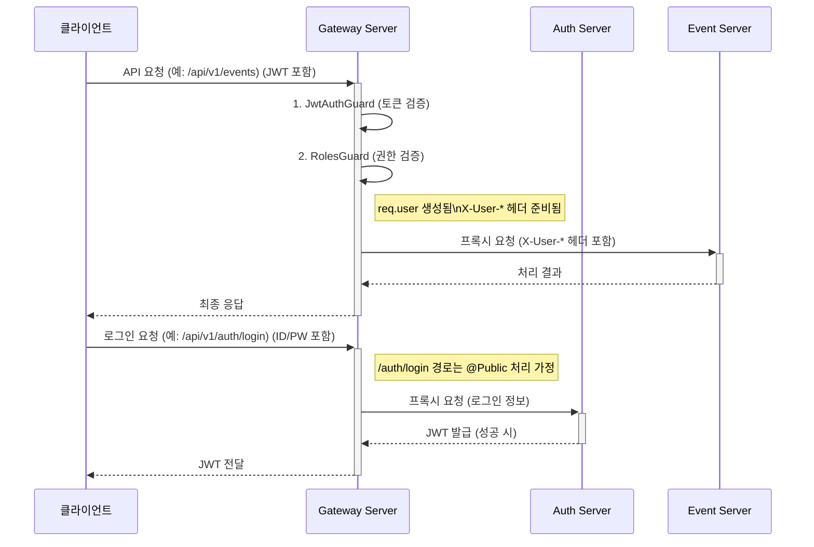

# Gateway Server (이벤트 보상 플랫폼)

본 서버는 이벤트 보상 플랫폼 마이크로서비스 아키텍처의 API Gateway 역할을 수행합니다. 모든 외부 클라이언트 요청의 진입점(Entry Point)으로서, 인증(Authentication), 인가(Authorization), 요청 라우팅(Request Routing) 등 공통 관심사를 처리합니다.

## 1. 시스템 내 위치 및 구성

Gateway Server는 클라이언트와 내부 마이크로서비스(Auth Server, Event Server 등) 사이의 중계자 역할을 합니다.



## 2. 주요 기능 및 동작 방식

### 2.1. API 진입점

* 모든 외부 요청은 Gateway Server의 `/api/v1` 전역 접두사를 통해 시스템으로 진입합니다.

### 2.2. 인증 및 인가 (Authentication & Authorization)

Gateway Server는 모든 요청에 대해 전역적으로 다음의 Guard를 순차적으로 적용하여 인증 및 인가를 처리합니다.

* **`JwtAuthGuard` (JWT 기반 인증)**:
  * 요청 헤더의 `Authorization: Bearer <토큰>`에서 JWT를 추출합니다.
  * 환경 변수 `JWT_SECRET`을 사용하여 토큰의 서명 및 만료 시간을 검증합니다.
  * 검증에 성공하면, 토큰 페이로드에 담긴 사용자 정보(userId, username, roles)를 `req.user` 객체에 첨부하여 다음 Guard나 핸들러로 전달합니다.
  * 컨트롤러나 특정 핸들러 메소드에 `@Public()` 데코레이터가 적용된 경우, 이 인증 과정을 건너뛰어 공개적으로 접근 가능한 엔드포인트를 설정할 수 있습니다.
    * 예시: `AppController`의 `login`, `register`, `healthCheck` 핸들러는 `@Public()`으로 지정되어 인증 없이 접근 가능합니다.
* **`RolesGuard` (역할 기반 접근 제어 - RBAC)**:
  * `JwtAuthGuard`가 성공적으로 통과된 후 실행됩니다.
  * 엔드포인트에 `@Roles(UserRole.ADMIN, UserRole.OPERATOR, ...)` 데코레이터로 접근에 필요한 역할(들)이 명시되어 있는지 확인합니다.
  * `req.user` 객체에 있는 사용자의 역할(`user.roles`)과 엔드포인트에 필요한 역할을 비교합니다.
  * 사용자가 필요한 역할을 하나라도 가지고 있지 않으면 `ForbiddenException` (403 에러)을 발생시켜 접근을 차단합니다.
  * `@Roles()` 데코레이터가 엔드포인트에 적용되지 않은 경우, 역할 검사를 수행하지 않고 통과시킵니다 (즉, 인증된 사용자는 누구나 접근 가능).

### 2.3. 요청 라우팅 및 프록시 (Request Routing & Proxying)

* **Public 경로 처리**:
  * `/api/v1/auth/login`, `/api/v1/auth/register` (POST 요청) 및 `/api/v1/` (GET 요청, 상태 확인) 경로는 `AppController`에 명시적인 핸들러(`login`, `register`, `healthCheck`)로 정의되어 있으며, `@Public()` 데코레이터가 적용되어 인증 절차를 건너뜁니다. 이들 요청은 `AppController`의 `handleProxy` 메소드를 통해 직접 처리됩니다.
* **기타 모든 요청**:
  * 위에서 언급된 Public 경로를 제외한 모든 요청은 `AppController`의 와일드카드 라우트 (`@All('*') proxyAllOtherRequests`)를 통해 처리됩니다.
  * 이 핸들러에는 `@Public()` 데코레이터가 없으므로, 전역으로 등록된 `JwtAuthGuard` 및 `RolesGuard`가 적용됩니다.
  * 인증 및 인가 검사를 통과한 요청은 `AppService`의 `proxyRequest` 메소드로 전달되어 내부 마이크로서비스로 라우팅됩니다.
* `proxyRequest` (또는 `handleProxy`를 통해 간접적으로) 메소드는 수신된 요청의 URL (`originalUrl`)을 분석합니다:
  * `/api/v1/auth/**` 패턴의 요청은 환경 변수 `AUTH_SERVER_URL`에 지정된 Auth Server로 프록시됩니다.
  * `/api/v1/events/**` 패턴의 요청은 환경 변수 `EVENT_SERVER_URL`에 지정된 Event Server로 프록시됩니다.
* 하위 마이크로서비스로 요청을 전달할 때, 기존 클라이언트 헤더와 함께 다음과 같은 커스텀 헤더를 추가하여 인증된 사용자 정보를 전파합니다:
  * `X-User-Id`: 인증된 사용자의 ID (UUID 또는 MongoDB ObjectId)
  * `X-User-Username`: 인증된 사용자의 이름
  * `X-User-Roles`: 인증된 사용자의 역할 목록 (콤마로 구분된 문자열, 예: "USER,OPERATOR")
    이를 통해 하위 서비스는 자체적으로 토큰을 다시 검증할 필요 없이 요청 컨텍스트에서 사용자 정보를 신뢰하고 활용할 수 있습니다.

### 2.4. 상태 확인 엔드포인트

* Gateway Server의 루트 경로 (`/api/v1/` 또는 `/`)로 `GET` 요청 시, "Gateway is running" 메시지를 포함한 JSON 응답을 반환하여 서비스의 정상 동작 여부를 간단히 확인할 수 있습니다.
  * 이 경로는 `AppController`의 `healthCheck` 메소드를 통해 처리되며, `@Public()` 데코레이터가 적용되어 인증 없이 접근 가능합니다.

## 3. 주요 요청 흐름 예시 (Mermaid)



## 4. 환경 변수

본 Gateway Server를 실행하기 위해 다음과 같은 환경 변수 설정이 필요합니다. `.env.example` 파일을 참조하여 `.env.development` 또는 `.env.production` 파일을 생성하고 값을 설정하십시오.

* `PORT`: Gateway Server가 실행될 포트 번호 (기본값: 3000)
* `JWT_SECRET`: JWT 서명 및 검증에 사용될 비밀 키. **반드시 Auth Server와 동일한 값으로 설정해야 합니다.**
* `AUTH_SERVER_URL`: Auth Server의 전체 URL (예: `http://localhost:3001/api/v1`)
* `EVENT_SERVER_URL`: Event Server의 전체 URL (예: `http://localhost:3002/api/v1`)
* `HTTP_TIMEOUT` (선택 사항): 하위 서비스로의 HTTP 요청 타임아웃 (밀리초 단위, 기본값: 5000)
* `HTTP_MAX_REDIRECTS` (선택 사항): 하위 서비스로의 HTTP 요청 시 최대 리다이렉션 횟수 (기본값: 5)

## 5. 실행 방법

1. **의존성 설치**:
   프로젝트 루트 디렉토리 및 `apps/gateway-server` 디렉토리에서 다음 명령어를 실행합니다.

   ```bash
   # 프로젝트 루트에서 전체 의존성 설치 (최초 1회 또는 필요시)
   # yarn install

   # Gateway Server 개별 의존성 설치 (필요시)
   cd apps/gateway-server
   yarn install
   ```
2. **환경 변수 설정**:
   `apps/gateway-server` 디렉토리에 `.env.development` 또는 `.env.production` 파일을 생성하고 위 "4. 환경 변수" 섹션을 참고하여 값을 설정합니다.
3. **서버 실행**:
   `apps/gateway-server` 디렉토리에서 다음 명령어를 실행합니다.

   ```bash
   # 개발 모드 (파일 변경 감지 및 자동 재시작)
   yarn start:dev

   # 운영 모드 (빌드 후 실행)
   # yarn build
   # yarn start:prod
   ```

   서버가 정상적으로 실행되면 콘솔에 `✅ 게이트웨이 서버가 다음 주소에서 실행 중입니다: http://localhost:[PORT]/api/v1` 와 같은 메시지가 출력됩니다.

## 6. 향후 개선 및 고려 사항 (Gateway Server)

* **Public 경로 명시적 처리**: (완료됨) `AppController`에 `/api/v1/auth/login`, `/api/v1/auth/register`, `/api/v1/` (상태 확인) 경로에 대한 명시적 핸들러를 추가하고 `@Public()` 데코레이터를 적용하여 인증 예외 처리를 명확히 했습니다. 나머지 요청은 `@All('*')` 핸들러를 통해 전역 Guard의 보호를 받습니다.
* **테스트 코드**: `JwtAuthGuard`, `RolesGuard`, 프록시 로직(`AppService`, `AppController`) 등 핵심 기능에 대한 단위 테스트 및 통합 테스트 코드를 작성하여 안정성을 높입니다.
* **고급 로깅 및 모니터링**: 요청 추적 ID(Correlation ID) 도입, Winston 또는 Pino 로거 사용, Sentry/Datadog 등 외부 모니터링 도구 연동을 고려합니다.
* **프록시 모듈화**: 현재 `AppService`에 통합된 프록시 로직을 각 마이크로서비스별 프록시 모듈(예: `AuthProxyModule`, `EventProxyModule`)로 분리하여 코드의 응집도를 높이고 유지보수성을 개선합니다.
* **API 속도 제한 (Rate Limiting)**: `@nestjs/throttler` 등을 사용하여 DoS/DDoS 공격으로부터 시스템을 보호하고 서비스 안정성을 확보합니다.
* **API 문서화 (Swagger/OpenAPI)**: Gateway를 통해 노출되는 API들에 대한 문서를 Swagger를 이용하여 자동으로 생성하고 제공합니다.
* **서킷 브레이커 패턴**: 하위 서비스의 장애가 Gateway 전체로 전파되는 것을 막기 위해 서킷 브레이커 패턴(예: `@nestjs/terminus`와 연계) 도입을 고려합니다.
